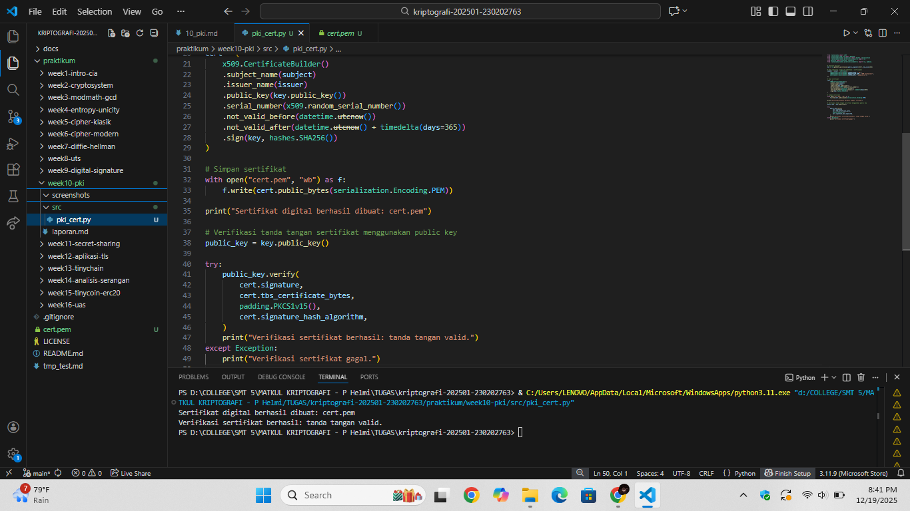

# Laporan Praktikum Kriptografi
Minggu ke-: 10  
Topik: Public Key Infrastructure (PKI & Certificate Authority)  
Nama: Laeli Maharani  
NIM: 230202763  
Kelas: 5IKRB  

---

## 1. Tujuan
1. Membuat sertifikat digital sederhana
2. Menjelaskan peran Certificate Authority (CA) dalam sistem PKI.
3. Mengevaluasi fungsi PKI dalam komnunikasi aman (contoh:HTTPS, TLS).

---

## 2. Dasar Teori
Public Key Infrastructure (PKI) adalah sebuah kerangka kerja keamanan yang digunakan untuk mengelola, mendistribusikan, dan memverifikasi kunci publik dalam sistem kriptografi simetris. PKI memungkinkan pengguna berkomunikasi secara aman dengan memastikan bahwa kunci publik yang digunakan benar-benar milik pihak yang sah. PKI memanfaatkan kriptografi kunci publik, sertifikat digital, dan kebijakan keamanan untuk menjaga kerahasiaan, integritas, serta autentikasi data.

Certificate Authority (CA) adalah lembaga terpercaya dalam PKI yang bertugas menerbitkan, memvalidasi, dan mencabut sertifikat digital. Sertifikat digital berisi informasi identitas pemilik, kunci prifat, serta tanda tangan digital dari CA sebagai bukti keabsahan. Dengan adanya CA, pengguna tidak perlu saling bertukar kunci publik secara langsung karena kepercayaan dialihakan kepada CA.

PKI dan CA banyak digunakan pada sistem keamanan modern seperti HTTPS, tanda tangan digital, email aman, dan autentikasi sistem. Keberadaan PKI memastikan bahwa komunikasi dilakukan dengan pihak yang benar dan data tidak diubah selama transmisi. Tanpa PKI dan CA, sistem kriptografi asimetris akan rentan terhadap serangan seperti man-in-the-middle.

---

## 3. Alat dan Bahan
- Python 3.x  
- Visual Studio Code / editor lain  
- Git dan akun GitHub  
- Library tambahan cryptography.

---

## 4. Langkah Percobaan
1. Membuat file `pki_cert.py` di folder `praktikum/week10-pki/src/`.
2. Menyalin kode program dari panduan praktikum.
3. Menginstal library `cryptography`.
4. Menjalankan program dengan perintah sesuai nama file.
5. Membuat folder `screenshots` di folder `praktikum/week10-pki/src.`.
6. Menempel hasil eksekusi program ke dalam folder `screenshots`.

---

## 5. Source Code
Langkah 1 -- Membuat Sertifikat Digital Sederhana
```python
from cryptography import x509
from cryptography.x509.oid import NameOID
from cryptography.hazmat.primitives import hashes, serialization
from cryptography.hazmat.primitives.asymmetric import rsa
from datetime import datetime, timedelta

# Generate key pair
key = rsa.generate_private_key(public_exponent=65537, key_size=2048)

# Buat subject & issuer (CA sederhana = self-signed)
subject = issuer = x509.Name([
    x509.NameAttribute(NameOID.COUNTRY_NAME, u"ID"),
    x509.NameAttribute(NameOID.ORGANIZATION_NAME, u"UPB Kriptografi"),
    x509.NameAttribute(NameOID.COMMON_NAME, u"example.com"),
])

# Buat sertifikat
cert = (
    x509.CertificateBuilder()
    .subject_name(subject)
    .issuer_name(issuer)
    .public_key(key.public_key())
    .serial_number(x509.random_serial_number())
    .not_valid_before(datetime.utcnow())
    .not_valid_after(datetime.utcnow() + timedelta(days=365))
    .sign(key, hashes.SHA256())
)

# Simpan sertifikat
with open("cert.pem", "wb") as f:
    f.write(cert.public_bytes(serialization.Encoding.PEM))

print("Sertifikat digital berhasil dibuat: cert.pem")
```

Langkah 2 --Memverifikasi sertifikat
Menggunakan public key untuk memverifiksi tanda tangan sertifikat.
```python
public_key = key.public_key()

try:
    public_key.verify(
        cert.signature,
        cert.tbs_certificate_bytes,
        padding.PKCS1v15(),
        cert.signature_hash_algorithm,
    )
    print("Verifikasi sertifikat berhasil: tanda tangan valid.")
except Exception:
    print("Verifikasi sertifikat gagal.")
```
Peran Certificate Authority (CA) dalam sistem PKI berperan sebagai pihak terpercaya yang menandatangani sertifikat digital. Tanda tangan CA memungkinkan pihak lain memverifikasi keaslian sertifikat menggunakan public key CA, sehingga identitas pemilik sertifikat dapat dipercaya.

Langkah 3 --Analisis PKI
- Bagaimana browser memverifikasi sertifikat HTTPS?
  Browser memverifikasi sertifikat HTTPS dengan memeriksa tanda tangan digital sertifikat menggunakan public key CA yang sudah dipercaya dan tersimpan di sistem browser. Jika tanda tangan valid dan sertifikat masih berlaku, koneksi dianggap aman.

- Apa yang terjadi jika CA palsu menerbitkan sertifikat?
Jika CA palsu menerbitkan sertifikat, browser tidak akan mempercayainya karena publik key CA tersbut tidak ada dalam daftar trusted CA. Akibatnya, browser akan menampilkan peringatan keamanan kepada pengguna.

- Mengapa PKI penting dalam komuniksi aman?
PKI penting karena memastikan autentiksi identitas, menjaga integritas data, dan memungkinkan pertukaran informasi secara aman, terutama pada transaksi online seperti perbankan dan e-commerce.

---

## 6. Hasil dan Pembahasan
Hasil eksekusi program:


Berdasarkan hasil eksekusi program, sistem berhasil menghasilkan sertifikat digital self-signed menggunakan algoritma kriptografi RSA dengan panjang kunci 2048 bit. Sertifikat tersebut ditandatangani menggunakan private key dan disimpan dalam format PEM (`cert.pem`).

Selanjutnya, dilakukan proses verifikasi tanda tangan sertifikat menggunakan public key yang bersesuaian. Hasil verifikasi menunjukkan bahwa tanda tangan digital pada sertifikat valid, yang berarti sertifikat benar-benar dibuat dan ditandatangani oleh pemilik private key yang sesuai, serta tidak mengalami perubahan data sejak ditandatangani.

Hasil ini membuktikan bahwa mekanisme Publik Key Infrastructure (PKI) bekerja dengan baik, dimana keaslian dari integritas sertifikat dapat dijamin melalui proses tanda tangan digital dan verifikasi menggunakan pasangankunci publik dan privat.

---

## 7. Jawaban Pertanyaan
1. Apa fungsi utama Certificate Authority (CA)?
Fungsi utama CA adalah memverifikasi identitas pihak yang memiliki kunci publik dan menerbitkan sertifikat digital sebagai bukti keabsahan identitas tersebut. CA bertindak sebagai pihak terpercaya yang memastikan bahwa kunci publik benar-benar milik entitas yang sah, serta mengelola mas aberlaku dan pencabutan sertifikat.

2. Mengapa self-signed certificate tidak cukup untuk sistem produksi?
Self-signed certificate tidak cukup untuk sistem produksi karena tidak diverifikasi oleh pihak terpercaya. Siapa pun dapat memubuat sertifikat sendiri tanpa validasi identitas, sehingga klien tidak dapat memastikan keaslian server. Akibatnya, self-signed certificate rentan terhadap serangan man-in-the-middle dan biasanya akan ditolak atau menampilkan peringatan keamanan pada browser.

3. Bagaimana PKI mencegah serangan MITM dalam komunikasi TLS/HTTPS?
PKI mencegah serangan MITM dalam komunikasi TLS/HTTPS ditandatangani oleh CA terpercaya. Saat koneksi TLS/HTTPS dibuat, klien memverifikasi sertifikat server menggunakan kunci publik CA. Jika sertifikat valid dan sesuai dengan domain, klien yakin bahwa ia berkomunikasi dengan server yang benar, sehingga penyerang tidak dapat menyamar sebagai server tanpa sertifikat yang sah.

---

## 8. Kesimpulan
Berdasarkan percobaan yang dilakukan, program berhasil membuat sertifikat digital self-signed menggunakan algoritma RSA dan menandatanganinya dengan private key. Proses verifikasi menggunakan public key menunjukkan bahwa tanda tangan sertifikat valid, sehingga keaslian dan integritas sertifikat dapat dipastikan. Percobaan ini membuktikan cara kerja dasar PKI dalam menjamin keamanan dan kepercayaan pada sertifikat digital.

---

## 9. Daftar Pustaka
(Cantumkan referensi yang digunakan.  
Contoh:  
- Katz, J., & Lindell, Y. *Introduction to Modern Cryptography*.  
- Stallings, W. *Cryptography and Network Security*.  )

---

## 10. Commit Log
```
commit week10-pki
Author: Laeli Maharani <laelimaharani09@gmail.com>
Date:   2025-12-19

    week10_pki: Public Key Infrastrukture (PKI & Certificate Authority dan laporan )
```
