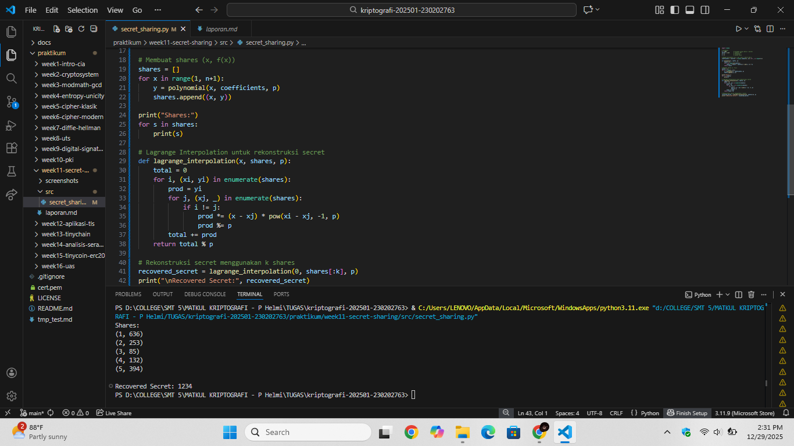

# Laporan Praktikum Kriptografi
Minggu ke-: 11  
Topik: Secret Sharing (Shamir's Secret Sharing)  
Nama: Laeli Maharani 
NIM: 2302020763  
Kelas: 5IKRB 

---

## 1. Tujuan
1. Menjelaskan konsep Shamir Secret Sharing (SSS).
2. Melakukan simulasi pembagian rahasia ke beberapa pihak menggunakan skema SSS.
3. Menganalisis keamanan skema distribusi rahasia..

---

## 2. Dasar Teori
Shamir's Secret Sharing adalah skema kriptografi yang digunakan untuk membagi sebuah rahasia menjadi beberapa bagian (share) sehingga rahasia tersebut tidak dapat diketahui dari satu bagian saja. Rahasia hanya dapat direkontruksi kembali jika jumlah minimum bagian tertentu (treshold) telah digabungkan. Metode ini dirancang untuk meningkatkan keamanan penyimpanan dan distribusi informasi sensitif.

Skema ini bekerja berdasarkan polinomial matematika di atas aritmetika modular. Sebuah rahasia disisipkan sebagai konstanta dalam polinomial berderajat k-1, lalu beberapa titik pada polinomial tersebut dibagikan sebagai share. Selama kurang dari k share dikumpulkan, nilai rahasia tetap tidak dapat ditebak secara matematis.

Shamir's Secret Sharing banyak digunakan pada sistem keamanan modern, seperti manajemen kunci kriptografi, backup kunci privat, dan kontrol akses terdistribusi, karena mampu mencegah satu pihak tunggal memiliki akses penuh terhadap rahasia penting.

---

## 3. Alat dan Bahan
- Python 3.x  
- Visual Studio Code / editor lain  
- Git dan akun GitHub  
- Library tambahan (misalnya pycryptodome, jika diperlukan)  )

---

## 4. Langkah Percobaan
1. Membuat file `secret_sharing.py` di folder `praktikum/week11-secret_sharing/src/`.
2. Menyalin kode program dari panduan praktikum.
3. Menjalankan program.
4. Membuat folder `screenshots` di folder `praktikum/week11-secret_sharing/src/`.
5. Menempel hasil eksekusi program ke folder `screenshots`.

---

## 5. Source Code
Langkah 1 -- Implementasi Shamir's Secret Sharing

```python
from secretsharing import SecretSharer

# Rahasia yang ingin dibagi
secret = "KriptografiUPB2025"

# Bagi menjadi 5 shares, ambang batas 3 (minimal 3 shares untuk rekonstruksi)
shares = SecretSharer.split_secret(secret, 3, 5)
print("Shares:", shares)

# Rekonstruksi rahasia dari 3 shares
recovered = SecretSharer.recover_secret(shares[:3])
print("Recovered secret:", recovered)
```

Langkah 2 -- Simulasi Manual (Tanpa Library)
```python
import random

# Parameter
p = 2089            # bilangan prima (harus > secret)
secret = 1234       # rahasia (a0)
k = 3               # threshold
n = 5               # jumlah share

# Bangun polinomial f(x) = a0 + a1*x + a2*x^2 mod p
coefficients = [secret] + [random.randint(1, p-1) for _ in range(k-1)]

def polynomial(x, coeffs, p):
    result = 0
    for i in range(len(coeffs)):
        result = (result + coeffs[i] * pow(x, i)) % p
    return result

# Membuat shares (x, f(x))
shares = []
for x in range(1, n+1):
    y = polynomial(x, coefficients, p)
    shares.append((x, y))

print("Shares:")
for s in shares:
    print(s)

# Lagrange Interpolation untuk rekonstruksi secret
def lagrange_interpolation(x, shares, p):
    total = 0
    for i, (xi, yi) in enumerate(shares):
        prod = yi
        for j, (xj, _) in enumerate(shares):
            if i != j:
                prod *= (x - xj) * pow(xi - xj, -1, p)
                prod %= p
        total += prod
    return total % p

# Rekonstruksi secret menggunakan k shares
recovered_secret = lagrange_interpolation(0, shares[:k], p)
print("\nRecovered Secret:", recovered_secret)
```
---

## 6. Hasil dan Pembahasan
Hasil eksekusi program: 
Langkah 2 -- Aimulasi Manual (Tanpa Library)


Pada tahap ini, Shamir Secret Sharing diimplementasikan secara manual untuk memahami konsep matematis di balik pembagian rahasia. Proses diawali dengan memilih sebuah bilangan prima p yang cukup besar sebagai modulus, sehingga seluruh perhitungan dilakukan dalam aritmetika modulo untuk menjaga keamanan data.

Selanjutnya dibangun sebuah polinomial berderajat k -1 dengan bentuk f(x) = a0 + a1x +...+ak-1x^k-1 (mod p). Dimana a0 merupakan nilai rahasia (secret) dan koefisien lainnya dipilih secara acak. Polinomial ini menjadi dasar pembentukan share.

Setiap share dibentuk sebagai pasangan nilai (x,f(x)) dengan nilai x yang berbeda. Share-share ini kemudian dibagikan kepada peserta. Untuk merekontruksi rahasia, digunakan interpolasi lagrange dengan minimal k buah share. Melalui proses ini, nilai polinomial pada x=0 dapat dihitung kembali sehingga rahasia asli berhasil diperoleh.

Langkah 3 -- Diskusi Shamir Secret Sharing
1. Mengapa skema (k,n) tetap aman karena kurang dari k share tidak memberikan informasi apa pun tentang secret. Secara matematis, banyak polinomial berbeda dapat dibentuk dari jumlah share yang kurang dari treshold, sehingga penyerang tidak dapat menebak nilai rahasia meskipun beberapa share bocor.

2. Risiko jika treshold k terlalu kecil atau terlalu besar. Jika k terlalu kecil, keamanan menurun karena sedikit share sudah cukup untuk merekontruksi secret, sehinga risiko kebocoran meningkat. Sebaliknya, jika k terlalu besar, sistem menjadi kurang fleksibel, karena kehilangan beberapa share saja dapat membuat secret tidak dapat dipulihkan.

3. Penerapan Shamir Secret Sharing di dunia nyata banyak digunakan dalam manajemen kunci cryptocurrency, di mana private key dibagi ke beberapa pihak agar tidak tersimpan di suatu tempat. Selain itu, SSS juga ditetapkan pada mekanisme recovery password dan pengamanan kunci master perusahaan, sehingga tidak ada satu pihak yang memegang kendali penuh atas rahasia penting.

---

## 7. Jawaban Pertanyaan
1. Keuntungan utama Shamir's Sharing dibanding membagikan salinan kunci langsung.
   - Tidak ada satu pihak pun yang menyimpan kumci utuh, sehingga lebih aman.
   - Jika satu share bocor atau hilang, rahasia tetap tidak terbuka.
   - Menghindari single poin of failure, karena kunci tidak bergantung pada satu orang atau satu kondisi.

2. Peran treshold (k) dalam keamanan secret sharing
   - Treshold k menentukan jumlah minimum share yang dibutuhkan untuk membuka rahasia.
   - Jika share yang terkumpul kurang dari k, rahasia tidak dapat direkonstruksi.
   - Semakin besar nilai k, semakin tinggi tingkat keamanannya, tetapi semakin sulit proses pemulihan rahasia.

3. Contoh skenario nyata penggunaan Shamir Seccret Sharing
   - Penyimpanan kunci privat cryptocurrency: kunci dibadi ke beberapa pengelola, dan hanya bisa digunakan jika minimal k orang setuju.
   - Sistem manajemen akses perusahaan: kunci utama server hanya dapat dipulihkan jika beberapa administrator bekerja sama.
   - Backup data penting: rahasia dibagi ke beberapa lokai untuk mencegah kehilangan total.

---

## 8. Kesimpulan
Praktikum ini menunjukkan bahwa Shamir Secret Sharing mampu membagi sebuah rahasia menjadi beberapa bagian (shares) sehingga rahasia hanya dapat direkonstruksi jika jumlah share memenuhi ambang batas (treshold). Meskipun sebagian share diketahui, rahasia tetap aman secara sistematis. Melalui simulasi manual berbasis polinomial dan interpolasi Lagrange, keamanan SSS tidak bergantung pada kerahasiaan algoritma, melainkan pada prinsip matematika dan pemilihan treshold yang tepat.

---

## 9. Daftar Pustaka
(Cantumkan referensi yang digunakan.  
Contoh:  
- Katz, J., & Lindell, Y. *Introduction to Modern Cryptography*.  
- Stallings, W. *Cryptography and Network Security*.  )

---

## 10. Commit Log
```
commit week11-secret-sharing
Author: Laeli Maharani <laelimaharani09@gmail.com>
Date:   2025-12-29

    week11-secret-sharing: implementasi Shamir's Secret Sharing dan laporan )
```
