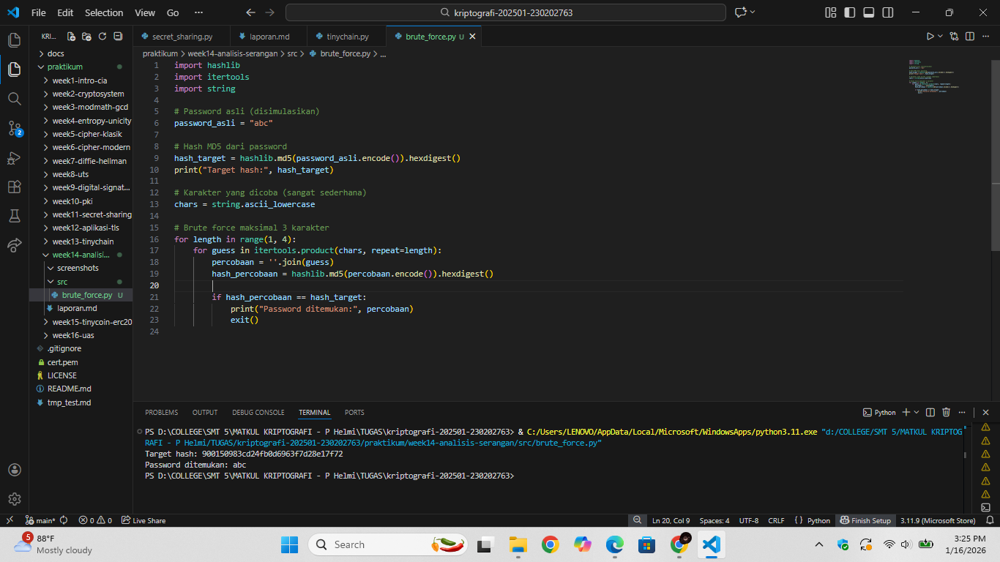

# Laporan Praktikum Kriptografi
Minggu ke-: 14  
Topik: Analisis Serangan Kriptografi  
Nama: Laeli Maharani  
NIM: 230202763  
Kelas: 5IKRB  

---

## 1. Tujuan
1. Mengidentifikasi jenis serangan pada sistem informasi nyata.
2. Mengevaluasi kelemahan algoritma kriptografi yang digunakan.
3. Memberikan rekomendasi algoritma kriptografi yang sesuai untuk perbaikan keamanan.

---

## 2. Dasar Teori
Analisis serangan kriptografi adalah proses mempelajari cara penyerang mencoba melemahkan atau memecahkan sistem kriptografi. Tujuannya untuk menilai seberapa aman algoritma dalam melindungi data. Analisis ini membantu menemukan kelemahan sebelum sistem digunakan secara luas.

Jenis serangan kriptografi dibedakan berdasarkan informasi yang dimiliki penyerang, seperti chipertext-only attack dan known-palintext attack. Ada juga serangan brute force yang mencoba semua kemungkinan kunci. Selain itu, serangan modern dapat memanfaatkan kelemahan implementasi sistem.

Analisis serangan kriptografi penting untuk memastkan keamanan informasi digital. Hasil analisis digunakan untuk memilih algoritma dan ukuran kunci yang kuat. Dengan demikian, sistem kriptogradi dapat melindungi data secara lebih aman dan andal.

---

## 3. Alat dan Bahan
- Python 3.x  
- Visual Studio Code / editor lain  
- Git dan akun GitHub  
- Library tambahan (misalnya pycryptodome, jika diperlukan)  )

---

## 4. Langkah Percobaan

1. Identifikasi serangan dengan memilih salah satu kasus myata serangan kriptografi.
2. Evaluasi kelemahan dengan menganalisis kelemahan algoritma yang digunakan. 
3. Rekomendasi Solusi dengan mengusulkan algoritma yang lebih aman.
4. Melakukan percobaan brute force sederhana. 

---

## 5. Source Code
Percobaan brute force sederhana: 
```python
import hashlib
import itertools
import string

# Password asli (disimulasikan)
password_asli = "abc"

# Hash MD5 dari password
hash_target = hashlib.md5(password_asli.encode()).hexdigest()
print("Target hash:", hash_target)

# Karakter yang dicoba (sangat sederhana)
chars = string.ascii_lowercase

# Brute force maksimal 3 karakter
for length in range(1, 4):
    for guess in itertools.product(chars, repeat=length):
        percobaan = ''.join(guess)
        hash_percobaan = hashlib.md5(percobaan.encode()).hexdigest()
        
        if hash_percobaan == hash_target:
            print("Password ditemukan:", percobaan)
            exit()
```
---

## 6. Hasil dan Pembahasan
Langkah 1 -- Identifikasi Serangan 
Kasus nyata : 
Contoh serangan kriptografi yang pernah terjadi adalah serangan Man-in-the-Middle (MITM) pada komunikasi SSL/TLS akibat Certificate Authority (CA) palsu. Salah satu kasus terkenal adalah insiden DigiNotar (2011), di mana sertifikat palsu diterbitkqan untuk domain terkenal.

Vektor serangan 
- Penyerang berhasil mendapatkan atau membuat sertifikat digital palsu.
- Sertifikat tersebut digunakan untuk menyamar sebagai website asli.
- Pengguna yang terhubung ke jaringan tidak aman (misalnya Wi-Fi buplik) diarahkan ke server palsu tanpa disadari).

Penyebab kelemahan :
- Kepercayaan penuh terhadap CA yang ternyata dikompromikan.
- Browser masih menganggap sertifikat tersebut valid.
- Pengguna tidak menyadari adanya pemalsuan identitas server.

Langkah 2 -- Evaluasi Kelemahan
Analisis Algoritma
- Algoritma Kriptografi (RSA, AES) sebenarnya masih kuat.
- Masalah utama bukan pada algoritma, tetapi pada kepercayaan (trust mode)PKI.
- Jika CA bocor maka seluruh sistem kepercayaan TLS ikut terancam.

Sumber Kelemahan 
- Implementasi dan manajemen CA yang tidak aman.
- Tidak adanya mekanisme deteksi cepat terhadap sertifikat palsu.
- Pengguna mengabaikan peringatan keamanan browser.

Langkah 3 -- Rekomendasi Solusi
Solusi yang disarankan
- Menggunakan Certificate Transparency (CT) untuk memantau sertifikat yang diterbitkan.
- Menerapkan HTTP Strict Transport Security (HSTS).
- Menggunakan OCSP Stapling untuk verifikasi status sertifikat.
- Edukasi pengguna agar tidak mengabaikan peringatan sertifikat.

Alasan Pemilihan Solusi
- Certificate Transparency memungkinkan deteksi sertifikat ilegal.
- HST mencegah downgrade ke HTTP.
- OSCP memastikan sertifikat tidak dicabut.

Dampak terhadap keamanan 
- Risiko MITM dapat ditekan secara signifikan.
- Identitas server lebih terjamin.
- Kepercayaan pengguna terhadap komunikasi TLS meningkat.

Hasil eksekusi program Brute Force sederhana


Berdasarkan hasil percobaan brute force sederhana terhadap hash MD5, terlihat bahwa password dengan kombinasi karakter pendek dapat ditemukan dalam waktu singkat. Hal ini menunjukkan bahwa algoritma hash lemah dan password sederhana sangat rentan terhadap serangan brute force.

---

## 7. Jawaban Pertanyaan

1. Mengapa banyak sistem lama masih tentan terhadap brute fordce atau dictionary attack?
Banyak sistem lama masih tenan karena dirancang pada masa ketika daya komputasi masih terbatas, sehingga algoritma dan mekanisme keamanannya tidak memperhitungkan keamampuan serangan modern. Contohnya, penggunaan hash lemah seperti MD5 atau SHA-1 dan passwoerd tanpa salt membuat proses brute force atau dictionary attack menjadi sangat cepat.

    Selain itu, sistem lama sering menggunakan password sederhana dan tidak menerapkan pembatasan percobaan login (rate limiting). Hal ini memungkinkan penyerang mencoba ribuan hingga jutaan kombinasi password tanpa terdeteksi atau diblokir.

    Faktor lain adalah kurangnya pembaruan sistem. Banyak organisasi tetap menggunakan sistem lama karena alasan kompatibilitas, biaya, atau risiko imigrasi, sehingga celak keamanan tetap terbuka.

2. Perbedaan kelemahan algoritma dan kelemahan implementasi

| Aspek | Kelemahan Algoritma | Kelemahan Implementasi |
|------|-------------------|----------------------|
| Sumber masalah | Desain algoritma kriptografi itu sendiri | Cara algoritma diterapkan dalam sistem |
| Contoh | MD5 dan SHA-1 rentan collision | Password disimpan tanpa salt |
| Dampak | Algoritma tidak aman walaupun diimplementasikan dengan benar | Algoritma kuat tetap bisa dibobol |
| Penyebab umum | Perkembangan komputasi dan kriptanalisis | Kesalahan konfigurasi atau coding |
| Solusi | Mengganti algoritma ke yang lebih aman | Memperbaiki implementasi dan konfigurasi |

Kelemahan algoritma terjadi ketika secara matematis algoritma sudah tidak aman, sehingga harus diganti. Sedangkan kelemahan implementasi muncul akibat kesalahan konfigurasi, coding, atau kebijakan keamanan, meskipun algoritma yang digunakan sebenarnya kuat.

3. Bagaimana organisasi memastikan sistem kriptografi tetap aman di masa depan?
Organisasi Harus menerapkan pembaruan algoritma secara berkala, mengikuti standar keamanan terbaru seperti penggunaan AES, SHA-256, ECC, serta mekanisme hash password modern seperti bcrypt, scrypt, atau Argon2. Selain itu, penging untuk menerapkan kebijakan pasword yang kuat dan proteksi seperti rate limiting dan multi-factor authentication (MFA).

    Audit keamanan dan penetration testing secara tutin juga diperlukan untuk mendeteksi kelemahan sejak dini. Dengan kombinasi algoritma kuat, implementasi yang benar, dan kebijakan keamanan yang baik, sistem kriptografi dapat tetap aman menghadapi ancaman di masa depan.

---

## 8. Kesimpulan
Berdasarkan praktikum analisis serangan kriptografi yang telah dilakukan, dapat disimpulkan bahwa bamyak kelemahan sistem keamanan tidak hanya berasal dari algoritma yang lemah, tetapi juga dari kesalahan implementasi dan konfigurasi. Percobaan dan studi kasus menunjukkan bahwa serangan seperti brute force dan pemanfaatan hash lemah masih efektif pada sistem lama. Oleh karena itu, penggunaan algoritma modern, implementasi yang benar, serta evaluasi keamanan secara berkala sangat penting untuk menjaga sistem kriptpgrafi tetap aman.

---

## 9. Daftar Pustaka
(Cantumkan referensi yang digunakan.  
Contoh:  
- Katz, J., & Lindell, Y. *Introduction to Modern Cryptography*.  
- Stallings, W. *Cryptography and Network Security*.  )

---

## 10. Commit Log

```
commit week14-analisis-serangan
Author: Laeli Maharani <laelimaharani09@gmail.com>
Date:   2025-01-16

    week14-analisis-serangan: implementasi analisis serangan dan laporan )
```
