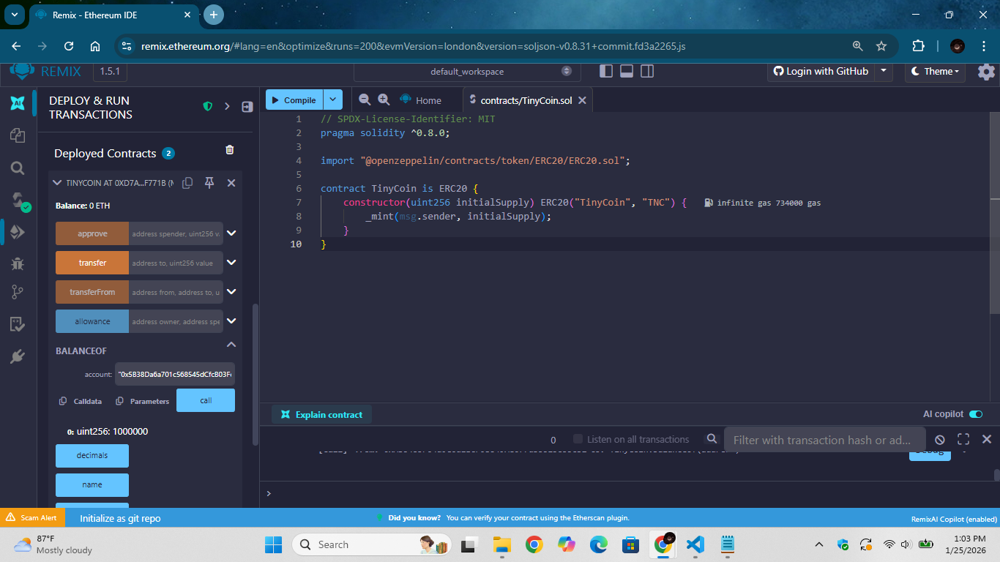
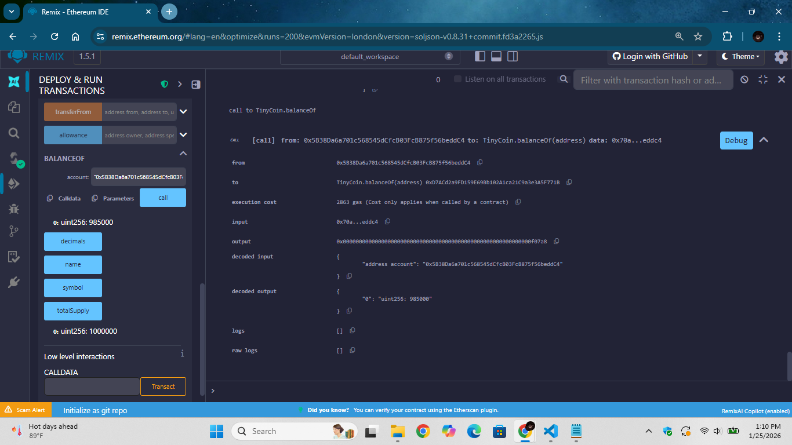
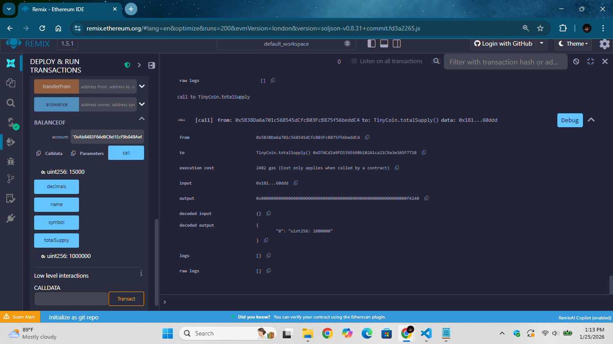

# Laporan Praktikum Kriptografi
Minggu ke-: 15  
Topik: TinyCoin ERC20  
Nama: Laeli Maharani  
NIM: 2300202763  
Kelas: 5IKRB  

---

## 1. Tujuan
1. Mengembangkan proyek sederhana berbasis algoritma kriptografi.
2. Mendokumentasikan proses implementasi proyek ke dalam repository Git.
3. Menyusun laporan teknis hasil proyek akhir.

---

## 2. Dasar Teori
TinyCOin ERC20 adalah contoh implementasi token digital berbasis standar ERC-20 yang berjalan di atas blockchain Ethereum. ERC-20 merupakan standar teknis yang mendefinisikan seperangkat fungsi dan aturan dasar agar sebuah token dapat dikenali, ditransfer, dan digunakan secara konsisten oleh wallet, smart contract, dan aplikasi terdesentralisasi (DApp). FUngsi utama dalam ERC-20 meliputi totalSupply, balance0f, transferm approve, dan transferFrom.

Dalam konteks TinyCoin, token ERC-20 digunakan untuk mensimulasikan aset digital yang dapat dipindahkan antar pengguna tanpa perantara. Setiap transaksi diatat secara transparan di blockchain, sehingga menjamin integritas data, keandalan, dan non-repudiation. Smart contract ERC-20 juga memungkinkan otomatisasi aturan, seperti pembatasan suplai token atau mekanisme persetujuan sebelum transfer.

Secara teori, penggunaan standar ERC-20 pada TinyCoin memudahkan interperobabilitas dan pengembangan sistem berbasis blockchain. Karena mengikuti standar yang sama, TInyCoin dapat dengan mudah diintegrasikan ke berbagai wallet, exchange, dan aplikasi DeFi, sekaligus menjadi media pembelajaran untuk memahami konsep tokenisasi, smart contract, dan ekonomi digital berbasis blockchain.

---

## 3. Alat dan Bahan
- Python 3.x  
- Visual Studio Code / editor lain  
- Git dan akun GitHub
- Remix IDE
- Browser
- Library tambahan (misalnya pycryptodome, jika diperlukan)  )

---

## 4. Langkah Percobaan
1. Pembuatan Kontrak
   - Membuka Remix IDE melalui browser.
   - Membuat file `TinyCoin.sol` di folder `contracts`.
   - Menuliskan kode kontrak ERC-20 TinyCoin dan menyimpannya.
2. Kompilasi Kontrak
   - Membuka menu Solidity Compiler di Remix
   - Memilih versi compiler yang sesuai (Solidity 0.8.x).
   - Tekan tombol Compile TinyCoin.sol hingga status berhasil.
3. Deploy Kontrak
   - Membuka menu Deploy & Run Transactions.
   - Memilih Environtment: JavaScript VM
   - Memilih Account[0] sebagai akun deployer
   - Mengisi nilai initalSupply (misalnya 1000000).
   - Tekan tombol Deploy hingga kontrak muncul di Deployed Contracts.
4. Uji Saldo Awal
   - Memanggil fungsi balanceOf(address).
   - Memastikan alamat Acount[0].
   - Saldo awal tampil sesuai dengan initialSupply.
5. Transfer Token
   - Memastikan akun aktif adalah Account[0].
   - Memanggil fungsi transfer(addres, amount).
   - Mengisi alamat akun penerima dan jumlah token (misalnya 15000).
   - Menjalankan transaksi hingga terminal menunjukkan transaksi berhasil.
6. Verifikasi Hasil
   - Mengecek saldo akun pengirim dan penerima dengan balanceOf.
   - Memanggil totalSupply() untuk memastikan jumlah token tetap sama.

---

## 5. Source Code
Kontrak ERC-20
```python
// SPDX-License-Identifier: MIT
pragma solidity ^0.8.0;

import "@openzeppelin/contracts/token/ERC20/ERC20.sol";

contract TinyCoin is ERC20 {
    constructor(uint256 initialSupply) ERC20("TinyCoin", "TNC") {
        _mint(msg.sender, initialSupply);
    }
}

```

---

## 6. Hasil dan Pembahasan
Langkah 1 -- Hasil Deploy Contract

Proses deployment kontrak TinyCoin.sol menggunakan Remix IDE pada jaringan JavaScript VM, saat melakukan deploy, initailSupply diisi sebesar 1.000.000, yang berarti seluruh token awal dicetak dan diberikan ke Account[0] (akun deployer). Kontrak berhasil di-deploy tanpa error dan menghasilkan alamat kontrak, menandakan kontrak siap digunakan untuk pengujian fungsi ERC-20.

---

Informasi Saldo Account[0] Sebelum Transfer

Pengecekan saldo awal menggunakan fungsi `balance0f(address)`. Alamat yang dimasukkan adalah Account[0], yaitu akun yang digunakan saat deploy kontrak. Hasilnya menampilkan saldo sebesar 1.000.000 token, sesuai dengan nilai initial supply yang diinput saat deployment.

---

Proses Transfer Token

Pada tahap ini dilakukan pengujian fungsi `transfer(address, amount)`. dengan memasukkan :
- Alamat penerima : Account[1] / Account[2]
- Jumlah token : 15.000
Setelah tomnol transact ditekan, terminal berwarna hijau muncul, yang menandakan bahwa transaksi berhasil dieksekusi tanpa error.

---

Informasi Saldo Account[0] Setelah Transfer

Hasil pengecekan ulang saldo Account[0] setelag proses transfer. Saldo berkurang dari 1.000.000 menjadi 985.000 token, yang merupakan hasil pengurangan 15.000 token yang dikirim ke akun penerima. Hal ini menunjukkan bahwa mekanisme pengurangan saldo pengirim bekerja dengan benar.

---

Informasi Saldo Account Penerima Setelah Transfer

Hasil pemanggilan fungsi `balance0f` pada akun penerima. Saldi akun penerima bertambah menjadi 15.000 token, sesuai dengan jumlah yang dikirim oleh Account[0]. Ini membuktikan bahwa token berhasil diterima oleh alamat tujuan.

---

Informasi Total Supply Token

Hasil pemanggilan fungsi `totalSupply`. Nilai total supply tetap 1.000.000 token, baik sebelum maupun setelah transfer. Hal ini menegaskan bahwa proses transfer ERC-20 tidak menciptakan atau menghilangkan token, melainkan hanya memindahkan kepemilikan token antar akun.

---

Analisis Keamanan Smart Kontrak

Kontrak TinyCoin menggunakan standar ERC29 dari OpenZeppelin yang telah diaudit dan relatif aman. Risiko seperti integer oferflow/underflow sudah dimitigasi secara otomatis oleh Solidity versi >_ 0.8. Selain itu, kontrak ini tidak mengandung fungsi eksternal kompleks sehingga risiko reentrancy sangat kecil. Namun, pada implementasi nyata, pengelolaan fungsi mint dan kontrol akses perlu diperhatikan agar tidak disalahgunakan.


---

## 7. Jawaban Pertanyaan
1. Apa fungsi utama ERC-20 dalam ekosistem blockchain?
Fungsi utama ERC-20 adalah sebagai standar token di blockchain Ethereum agar semua token memiliki aturan dan fungsi yang sama. Dengan adanya standar ini, token dapat:
- Digunakan dan dikenali oleh wallet, exchange, dan DApp tanpa penyesuaian khusus.
- Mempermudah pertukaran token karena format dan cara kerjanya seragam.
- Mendukung pengembagnan ekosistem DeFi, NFT marketplace (sebagai alat bayar), dan sistem ekonomi digital lainnya.
- ERC-20 membuat token kompatibel, interoperable, dan mudah diintegrasikan dalam ekosistem blockchain Ethereum.

2. Bagaimana mekanisme transfer token bekerja dalam kontrak ERC-20?
Mekanisme transfer token ERC-20 bekerja melalui fungsi utama berikut:
- `transfer(to, amount)` Digunakan untuk megnirim token langsung dari pemilik ke alamat lain. Saldo pengirim berkurang dan saldo penerima bertambah.
- `approve(spender, amount)` Pemilik token memberi izin kepada pihak lain (misalnya smart contract) untuk menggunakan tokennya sampai jumlah tertentu.
- `transferForm(form, to, amount)` Digunakan oleh pihak yang sudah diberi izin untuk memindahkan token atas nama pemilik.
Setiap transfer akan :
- Dicek apakah saldo mencukupi.
- Dicatati di blockchain secara permanen.
- Memicu event `Transfer` agar dapat dilacak oleh sistem lain.

3. Apa risiko utama dalam implementasi smart contract dan bagaimana cara mitigasinya?
Risiko utama dalam smart contract ERC-20 antara lain:
- Bug atau kesalahan logika kode. Contoh kesalahan perhitungan saldo atau akses tanpa izin.
- Kerentanan keamanan, Seperti reentrancy attack, integer overflow/underflow, atau salah penggunaan `approve`.
- Kontrak tidak bisa diubah (immutable), jika sudah ter-deploy dan ada bug, perbaikannya sangat sulit.
Cara mitigasi risiko:
- Melakukan audit kode sebelum deployment.
- Menggunakan library terpercaya seperti OpenZeppelin.
- Menerapkan testing menyeluruh (unit test dan simulasi test).
- Membatasi fitur sensitif dan menggunakan best practice Solidity.

---

## 8. Kesimpulan
Berdasarkan percobaan yang telah saya lakukan, kontrak TinyCoin ERC20 berhail dibuat, dikompilasi, dan di-deploy dengan baik menggunakan Remix IDE. Pengujian fungsi `balanceOf` dan `transfer` menunjukkan bahwa mekanisme distribusi token berjalan sesuai standar ERC20 dan total supply ERC20 dapat digunakan untuk mengelola token digital secara aman dan terstruktur.

---

## 9. Daftar Pustaka
(Cantumkan referensi yang digunakan.  
Contoh:  
- Katz, J., & Lindell, Y. *Introduction to Modern Cryptography*.  
- Stallings, W. *Cryptography and Network Security*.  )

---

## 10. Commit Log

```
commit week15-tinycoin-erc20
Author: Laeli Maharani <laelimaharani09@gmail.com>
Date:   2026-01-25

    week15-tinycoin-erc20: implementasi tinycoin ERC-20 dan laporan )
```
