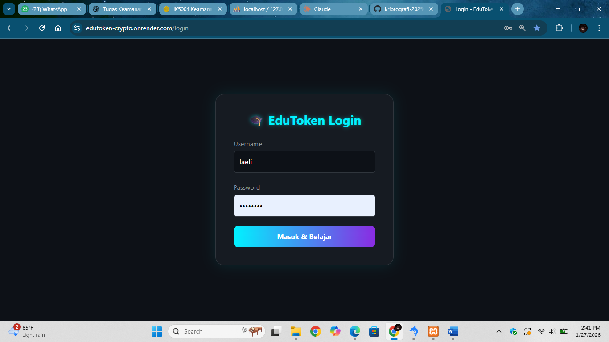
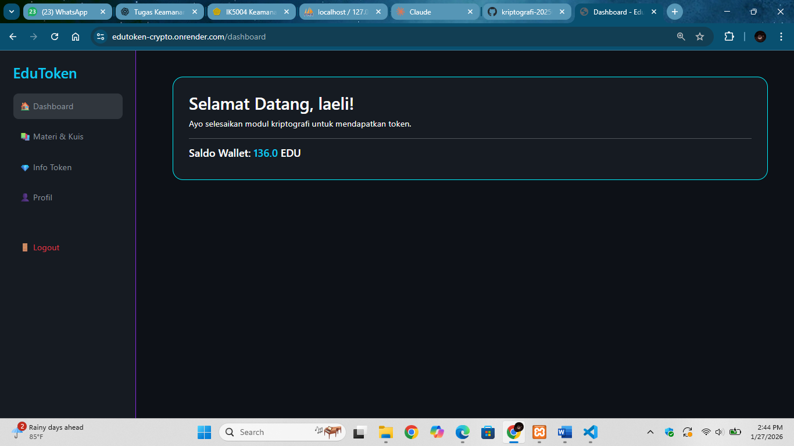
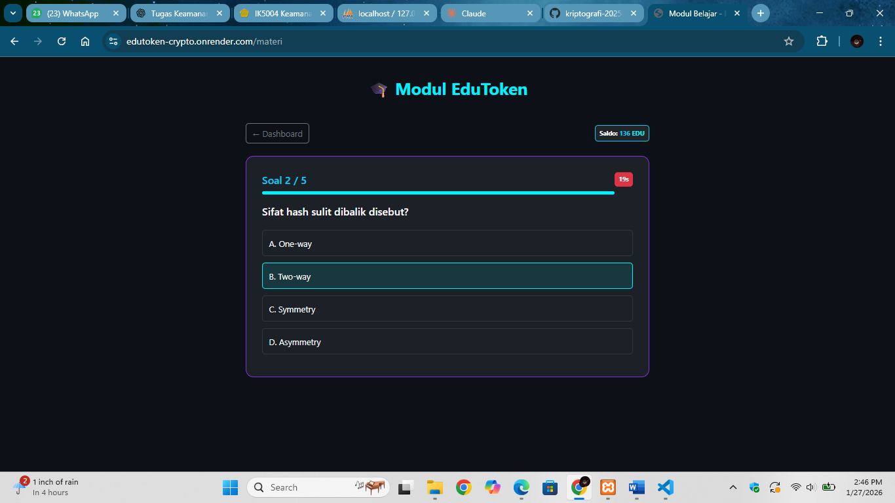
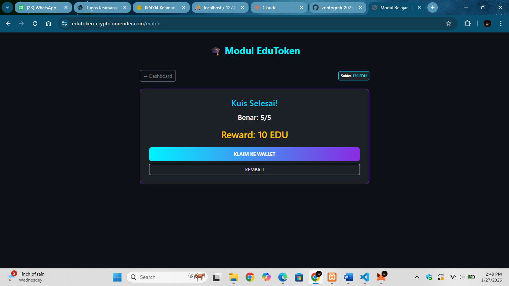
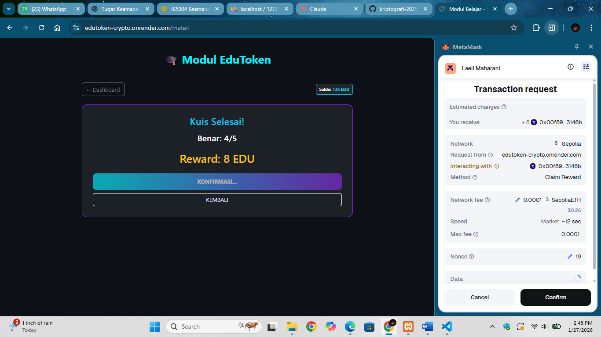
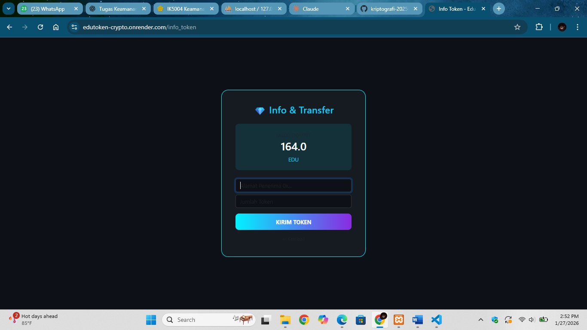
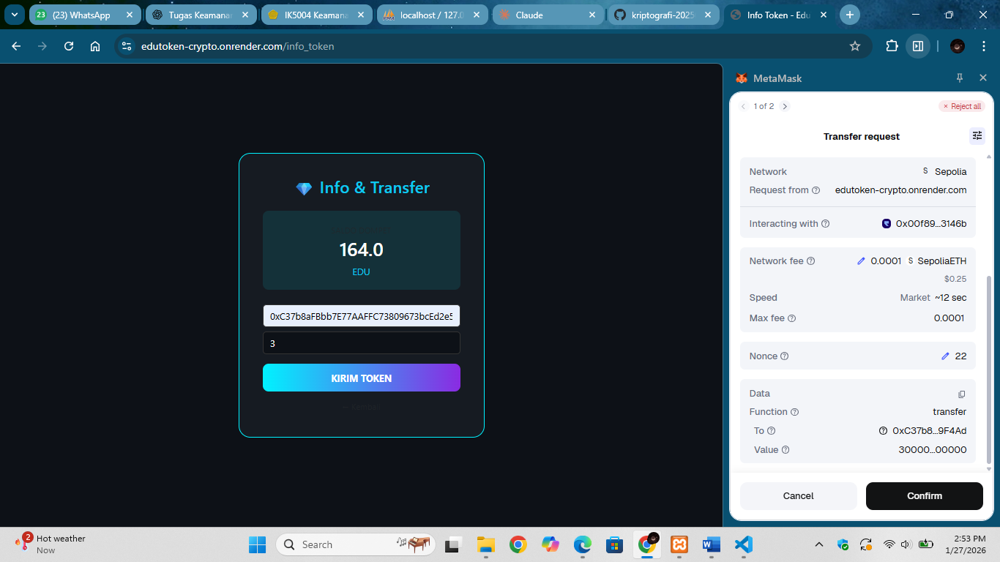
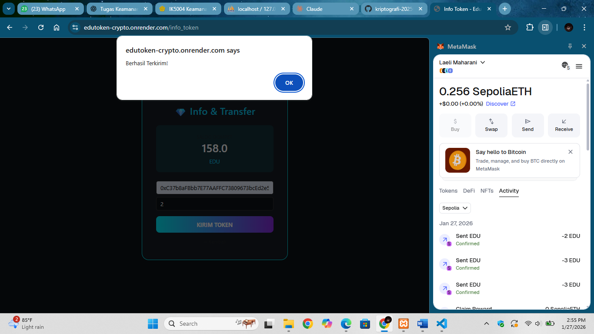
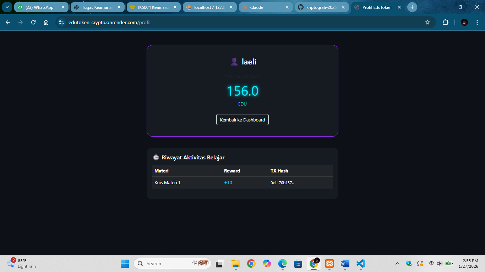

# Laporan Praktikum Kriptografi
Minggu ke-: 16  
Topik: Ujian Akhir Semester 
Nama: Laeli Maharani  
NIM: 230202763  
Kelas: 5IKRB  

---

## 1. Tujuan
Tujuan dikembangkannya projek EduToken :
1. Membangun aplikasi edukasi berbasis blockchain yang menyajikan konsep kriptografi secara praktis melalui platfrom pembelajaran berbasis web yang interaktif.
2. Menggabungkan materi ajak dan kuis dengan mekanisme reward berupa token digital untuk meningkatkan keterlibatan pengguna.
3. Memanfaatkan smart contract ERC-20 di jaringan Ethereum Sepolia melalui integrasi MetaMask sebagai basis teknologi utama.
4. Memperagakan protokol keamanan digital, termasuk proses hashing, autentikasi, serta jaminan integritas data dalam setiap transaksi yang dilakukan.


---

## 2. Dasar Teori
Teknologi blockchain hadir sebagai sistem basis data terdistribusi yang menawarkan transparansi, keamanan, dan desentralisasi yang unggul. Di sektor pendidikan, teknologi ini memiliki potensi besar sebagai instrumen pendukung pembelajaran, terutama melalui mekanisme reward berbasis token digital. Pendekatan ini bertujuan untuk menciptakan ekosistem belajar yang lebih dinamis guna meningkatkan motivasi serta partisipasi aktif mahasiswa dalam mengikuti materi perkuliahan.

Di sisi lain, kriptografi merupakan pilar fundamental menjamin keamanan data dan validitas transaksi di dalam blockchain. Prinsip-prinsip seperti hashing, enkripsi, dan tanda tangan digiral menjadi dasar utama yang menjaga integritas sistem tersebut. Namun, pemahaman terhadap kriptografi sering kali menjadi tantangan bagi mahasiswa karena sifatnya yang abstrak dan jarang disajikan dalam bentuk aplikasi praktis yang mudah dipahami.

Sebagai solusi atas tantangan tersebut, platform EduToken dikembangkan untuk mengintegrasikan konsep kriptografi langsung dengan teknologi blockchain Ethereum. Melalui pemanfaatan smart contract ERC-20 yang dibangun dengan bahasa Solidity pada jaringan Sepolia Tesnet, mahasiswa dapat memperoleh pengalaman nyata dalam mengelola transaksi dan protokol keamanan. Sistem ini memungkinkan mahasiswa belajar secara eksperimental melalui pemberian token sebagai imbalan kuis tanpa memerlukan biaya transaksi yang sebenarnya.

---

## 3. Alat dan Bahan
- Python 3.x  
- Visual Studio Code / editor lain  
- Git dan akun GitHub  
- Remix IDE
- Akum MetaMask
- Onrender
- Frontend menggunaakn HTML, CSS, JavaScript
- Smart contract menggunakan solidity
- Netword menggunakan Ethereum Sepolia

---

## 4. Langkah Percobaan

## 1. Login ke website EduToken


- Login ke website EduToken dengan masuk melalui : https://edutoken-crypto.onrender.com/
- User diminta login dengan memasukkan username dan password.

---
## 2. Tampilan Dashboard EduToken


- Setelah user berhasil login akan diarahkan ke menu dashboard Edutoken yang didalamnya menampilkan informasi Saldo Wallet pada EduToken.
- Pada bagian navigasi sidebar, tersedia bebreapa menu utama, yaitu materi dan kuis pembelajaran, informasi token, profile pengguna, dan logout.
   
---
## 3. Tampilan Menu Materi dan Kuis


- Pada menu materi dan kuis, sistem menyediakan beberapa materi pembelajaran singkat yang terbagi menjadi materi1, materi2, dan materi3. 
- Setelah mempelajari materi yang tersedia, user dapat melanjutkan ke tahap evaluasi dengan menekan tombol mulai kuiz untuk mengerjakan kuis pembelajaran yang telah disediakan oleh sistem.

---
## 4. Tampilan mengerjakan kuis


- Pada tahap pengerjaan kuis, sistem menampilkan halaman soal yang terdiri dari total 5 pertanyaan.
- Setiap soal memiliki bobot reward sebesar dua token apabila dijawab dengan benar. Dengan demikian, apabila pengguna berhasil menjawab seluruh soal dengan benar, maka pengguna akan memperoleh total 10 token sebagai hasil evaluasi pembelajaran.

---
## 5. Tampilan Klaim Token


- Setelah pengguna menyelesaikan seluruh soal kuis, sistem menampilkan halaman evaluasi yang menunjukkan reward pembelajaran yang diperoleh.
- Pengguna dapat menekan tombol klaim ke wallet untuk memproses pengiriman token EDU ke dompet digital milik pengguna melalui mekanisme transaksi blockchain.

---
## 6. Tampilan Konfirmasi Klaim


- Setelah pengguna menekan tombol klaim ke wallet, sistem  secara otomatis akan terhubung dengan dompet digital MetaMask milik pengguna.
- Metamask menampilkan notifikasi konfirmasi transaksi yang berisi detail pengiriman token EDU.
- Pengguna diminta menekan tombol confirm sebagai persetujuan transaksi.
- Setelah konfirmasi diberikan, proses klaim token berhasil dilakukan dan token EDU dikirm ke wallet pengguna melalui jaringan blockchain.

---
## 7. Tampilan Notifikasi Berhasil Klaim Token


- Setelah dikonfirmai sistem akan memberikan notifikasi bahwa token berhasil diklaim dan klik "oke".

---
## 8. Tampilan Menu Info Token dan Transfer


- Sistem menyediakan fitur pengiriman token EDU antar pengguna.
- Pada halaman ini, pengguna diminta untuk memasukkan alamat wallet tujuan (address) serta jumlah token EDU yang akan dikirim.
- Data tersebut kemudian diproses oleh sistem untuk dilakukan transaksi transfer token melalui smart contract pada jaringan blockchain, sehingga pengguna dapat memahami mekanisme pengiriman aset digital antar wallet.

---
## 9. Tampilan Konfirmasi Kirim Token

- Setelah pengguna menekan tombol kirim token, sistem akan memunculkan permintaan konfirmasi transaksi melalui MetaMask.

--
## Tampilan Notifikasi Berhasil Transfer

- Setelah pengguna menekan tombol confirm, sistem menampilkan notifikasi bahwa token EDU berhasil terkirim, serta saldo token pengguna secara otomatis berkurang sesuai dengan jumlah token yang ditransfer.

--
## Tampilan Menu Profile

- Pada halaman profile terdapat informasi tentang username pengguna, jumlah token, dan riwayat aktivitas belajar. 

---

## 5. Source Code
Smart Contract ERC-20 yang Digunakan: 

```python
// SPDX-License-Identifier: MIT
pragma solidity ^0.8.20;

import "@openzeppelin/contracts/token/ERC20/ERC20.sol";

contract EduToken is ERC20 {
    address public admin;

    constructor() ERC20("EduToken", "EDU") {
        admin = msg.sender;
        _mint(msg.sender, 1000000 * 10 ** decimals()); // Mint 1 juta token ke admin
    }

    // Fungsi untuk memberikan reward kepada siswa
    function claimReward(address student, uint256 amount) public {
        // Pastikan kontrak punya saldo yang cukup untuk memberi reward
        require(balanceOf(admin) >= amount, "Saldo Admin tidak cukup");
        _transfer(admin, student, amount);
    }
}
```
)

---

## 6. Hasil dan Pembahasan
Berdasarkan hasil uji coba yang telah dilakukan, sistem EduToken yang telah berhasil dioperasikan dan berfungsi sesuai dengan rancagan awal. Pengguna dapat melakukan autentikasi login, mengoneksikan dompet digital MetaMask, mempelajari modul, hingga menyelesaikan kuis untuk mendapatkan imbalan berupa token EDU. Proses distribusi reward tersebut terbuksi sukses terkirim ke wallet pengguna melalui transaksi blockchain di jaringan Ethereum Sepolia Tesnet. Praktikum ini membuktikan bahwa integrasi antarmuka web dan teknologi blockchain berjalan optimal, sehingga tandan tangan digital dapat dipelajari seara konkret. Meskipun masih memiliki limitasi terkait penggunaan jaringan uji coba dan aspek keamanan mandiri pada sisi pengguna, sistem ini telah memberikan pemahaman aplikatif yang signifikan bagi mahasiswa.

Kelebihan dan Kekurangan Sistem EduToken
Kelebihan Sistem :
- Integritas data tinggi: Memanfaatkan teknologi blockchain yang menjamin transparansi data dan sifat yang tidak dapat diubah (immutable).
- Otomatisasi Aman: Proses pembagian token dikelola secara otomatis oleh smart contract ERC-20, yang meminimalisir kesalahan manual.
- Protokol Keamanan Berlapis: Menjamin keamanan setiap transaksi melalui penerapan fungsi hash, kriptografi kunci publik, dan digital signature.
- Privasi Kunci Terjaga: Private key pengguna tetap aman karena dikelola sepenuhnya oleh MetaMask dan tidak pernah tersimpan di server aplikasi.
- Metode Belajar Interaktif: Adanya insentif berbasis token mampu memicu antusisasme serta keterlibatan pengguna dalam proses pembelajaran.
- Orientasi Praktis: Mengubah teori kriptografi yang kompleks menjadi pengalaman belajar yang nyata dan mudah dipahami.

Kekurangan sistem:
- Keterbatasan Lingkungan: Aplikasi masih beroprasi pada jaringan Sepolia (Tesnet), sehingga belum siap untuk digunakan pada skala produksi komersial.
- Risiko Faktor manusia: Keamanan aset sangat bergantung pada kedisiplinan masing-masing pengguna dalam menjaga kerahasiaan private key.
- Kapasitas terbatas, sistem belum dioptimalkan untuk menangani beban trafik tinggi atau penggunaan masif secar serentak.
- Ketergantungan eksternal. Operasional sistem sangat dipengaruhi oleh skalabilitas koneksi internet serta ketersediaan ekstensi MetaMask pada perangkat pengguna.

---

## 7. Jawaban Pertanyaan

---

## 8. Kesimpulan
Berdasarkan rangkaian proses desain, pengembangan, hingga uji coba yang telah dilaksanakan, sistem EduToken sukses direalisasikan sebagai Learning Management System (LMS) interaktif yang memanfaatkan ekosistem blockchain Ethereum melalui standar ERC-20 pada jaringan Sepolia Testnet. Penggunaan pilar kriptografi, seperti kriptografi asimetris, fungsi hashing Keccak-256, serta tanda tangan digital ECDSA, secara efektif menjamin aspek keamanan, validasi autentikasi, dan integritas pada setiap transaksi token EDU. Lebih jauh lagi, integrasi token sebagai elemen gamifikasi dalam proses belajar membuktikan bahwa teknologi blockchain mampu mentransformasi konsep kriptografi yang teoretis menjadi pengalaman Web3 yang lebih nyata, praktis, dan aplikatif bagi pengguna.

---

## 9. Daftar Pustaka
(Cantumkan referensi yang digunakan.  
Contoh:  
- Katz, J., & Lindell, Y. *Introduction to Modern Cryptography*.  
- Stallings, W. *Cryptography and Network Security*.  )

---

## 10. Commit Log

```
commit week16-uas
Author: Laeli Maharani <laelimaharani09@gmail.com>
Date:   2026-01-27

    week16-uas: uas kriptografi EduToken
