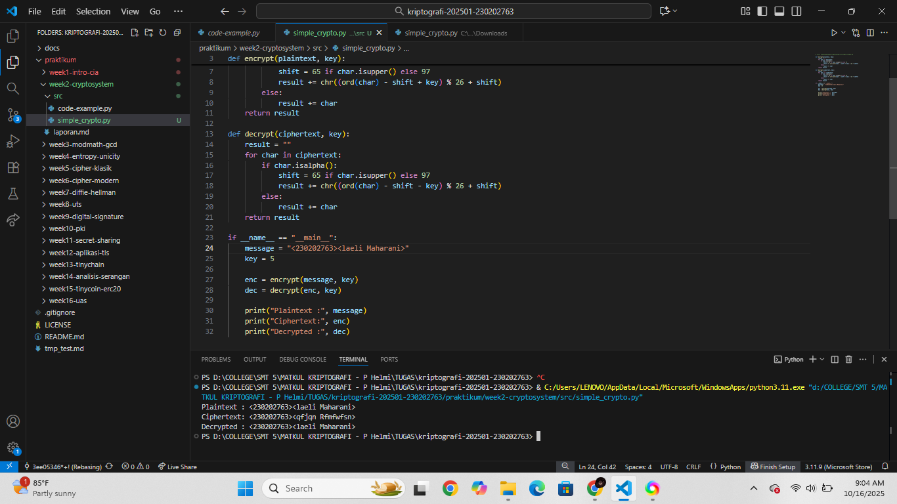

# Laporan Praktikum Kriptografi
Minggu ke-: 2 
Topik: Cryptosystem (Komponen, Enkripsi, dan Dekripsi, Simetris & Asimetris)  
Nama: Laeli Maharani
NIM: 230202763  
Kelas: 5IKRB 

---

## 1. Tujuan
1. Mengidentifikasi komponen dasar kriptosistem (plaintext, ciphertext, kunci, algoritma).
2. Menggambarkan proses enkripsi dan dekripsi sederhana.
3. Mengklasifikasikan jenis kriptosistem (simetris dan asimetris).

---

## 2. Dasar Teori
Pada era klasik, metode enkripsi yang digunakan untuk menjaga kerahasiaan informasi bersifat sederhana. Salah satu contohnya adalah Cipher Caesar, yang melakukan penyandian pesan dengan cara menggeser setiap huruf dalam teks asli ke posisi tertentu di dalam alfabet. Misalnya, jika menggunakan kunci pergeseran 3, huruf A akan menjadi D, B menjadi E, dan seterusnya. Teknik ini termasuk dalam kategori substitution cipher karena setiap huruf digantikan dengan huruf lain berdasarkan pola yang telah ditentukan. Meskipun mudah untuk dipahami dan diimplementasikan, Cipher Caesar memiliki tingkat keamanan yang rendah akibat jumlah kunci yang terbatas, sehingga dapat dengan mudah dipecahkan oleh para kriptoanalis.

Selain itu, terdapat juga Vigenere Cipher, yang mengandalkan penggunaan kunci berbentuk kata untuk menggeser huruf secara bergantian. Metode ini menawarkan sedikit peningkatan keamanan dibandingkan dengan teknik sebelumnya, namun tetap rentan terhadap analisis frekuensi dan metode kriptoanalisis yang sederhana. Secara keseluruhan, meskipun metode kriptografi klasik ini efektif pada masanya, mereka tidak mampu menghadapi tantangan yang muncul seiring perkembangan teknik analisis yang lebih canggih.

---

## 3. Alat dan Bahan
(- Python 3.x  
- Visual Studio Code / editor lain  
- Git dan akun GitHub  
- Library tambahan (misalnya pycryptodome, jika diperlukan)  )

---

## 4. Langkah Percobaan
1. Membuat file `simple_crypto.py` di folder `praktikum/week2-cryptosystem/src/`.
2. Menyalin kode program dari panduan praktikum.
3. Menjalankan program dengan perintah `python simple_crypto.py`.)
4. Membuat ringkasan perbedaan antara kriptosistem simetris dan asimetris.
5. Mengupload hasil eksekusi di folder `praktikum/week2-cryptosistem/screenshots/`
6. Menjawab pertanyaan diskusi.

---

## 5. Source Code
```
# file: praktikum/week2-cryptosystem/src/simple_crypto.py

def encrypt(plaintext, key):
    result = ""
    for char in plaintext:
        if char.isalpha():
            shift = 65 if char.isupper() else 97
            result += chr((ord(char) - shift + key) % 26 + shift)
        else:
            result += char
    return result

def decrypt(ciphertext, key):
    result = ""
    for char in ciphertext:
        if char.isalpha():
            shift = 65 if char.isupper() else 97
            result += chr((ord(char) - shift - key) % 26 + shift)
        else:
            result += char
    return result

if __name__ == "__main__":
    message = "<230202763><laeli Maharani>"
    key = 5

    enc = encrypt(message, key)
    dec = decrypt(enc, key)

    print("Plaintext :", message)
    print("Ciphertext:", enc)
    print("Decrypted :", dec)
```
---

## 6. Hasil dan Pembahasan
Diagram Kriptosystem :


Hasil eksekusi program Caeshar Chiper :


)
```
---
```
## 7. Jawaban Pertanyaan
(Jawab pertanyaan diskusi yang diberikan pada modul.  
- Pertanyaan 1: Komponen utama dalam sebuah criptosistem :
- Plaintext : adalah data atau pesan asli yang ingin dilindungi sebelum dienkripsi.
- Chipertext : Adalah hasil dari proses enkripsi terhadap plaintext. Teks ini sudah dibubah menadi bentuk acak yang dapat dibaca tanpa kunci.
- Algoritma Kriptografi : Adalah proses atau rumus matematis yang digunakan untuk melakukan enksripsi dan dekripsi. Enkripsi adalah plaintext menjadi chiphertext, Dekripsi: mengubah chiphertext kembali menjadi plaintext.
- Key (Kunci Kriptografi) Adalah nilai rahasia yang dihunakan oleh algoritma untuk mengenkripsi dan dekripsi data. Jenis jenis kunci : kunci simeteris : satu kunci digunakan untuk enkripsi dan dekripsi. Kunci Asimetris : menggunakan sepasang kunci yaitu publik dan kunci privat.
- Protokol Kriptografi : Adalah aturan yang menentukan bagaimanan algoritma dan kunci digunakan agar komunikasi tetap aman.
- Fungsi Hash :: digunakan untuk mengubah data dengan panjang bebas menjadi nilai keluaran dengan panjang tetap. Hasil hash tidak bisa dikembalikan ke bentuk aslinya. Fungsi hash biasanya digunakan untuk menjaga integritas data dan penyimpanan password.
)
---

## 8. Kesimpulan
(Tuliskan kesimpulan singkat (2–3 kalimat) berdasarkan percobaan.  )

---

## 9. Daftar Pustaka
(Cantumkan referensi yang digunakan.  
Contoh:  
- Katz, J., & Lindell, Y. *Introduction to Modern Cryptography*.  
- Stallings, W. *Cryptography and Network Security*.  )

---

## 10. Commit Log
(Tuliskan bukti commit Git yang relevan.  
Contoh:
```
commit abc12345
Author: Nama Mahasiswa <email>
Date:   2025-09-20

    week2-cryptosystem: implementasi Caesar Cipher dan laporan )
```
