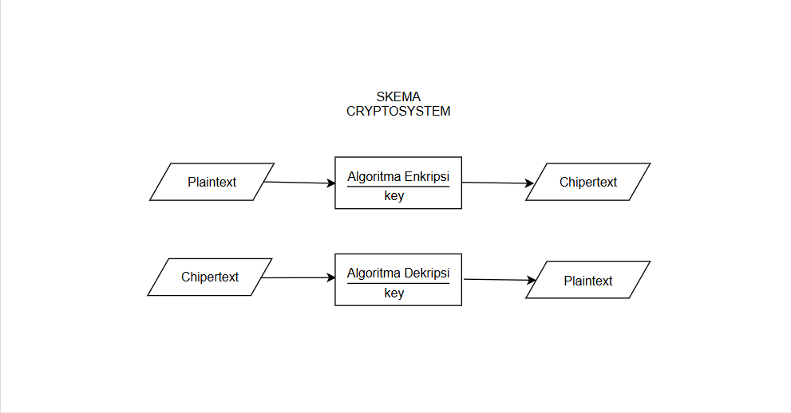

# Laporan Praktikum Kriptografi
Minggu ke-: 2 
Topik: Cryptosystem (Komponen, Enkripsi, dan Dekripsi, Simetris & Asimetris)  
Nama: Laeli Maharani
NIM: 230202763  
Kelas: 5IKRB 

---

## 1. Tujuan
1. Mengidentifikasi komponen dasar kriptosistem (plaintext, ciphertext, kunci, algoritma).
2. Menggambarkan proses enkripsi dan dekripsi sederhana.
3. Mengklasifikasikan jenis kriptosistem (simetris dan asimetris).

---

## 2. Dasar Teori
# Pengertian Kriptosistem 
Kriptosistem adalah suatu sistem yang digunakan untuk melindungi data agar tidak dibaca oleh pihak yang berwenang. Sistem ini bekerja dengan cara mengubah pesan asli (plaintext) menjadi bentuk sandi (chipertext0 melalui proses enkripsi, dan mengembalikannya lagi ke bentuk semuka melalui proses degnan menggunakan kunci tertentu.

# Komponen Utama Kriptosistem 
Komponen utama dalam kriptosistem meliputi plaintext, chipertext, algoritma enkripsi, algoritma dekripsi, dan kunci. Kunci berfungsi sebagai elemen rahasia yang menentukan hasil enkripsi dan dekripsi, sehingag menjaga kerahasiaan pesan.

# Enkripsi dan Dekripsi
Enkripsi adalah proses mengubah data asli menjadi proses bentuk sandi agar tidak dapat dibaca oleh pihak lain. Sebaliknya, dekripsi adalah proses untuk mengembalikan data yang telah disandikan menjadi bentuk aslinya dengan menggunakan kunci yang sesuai.

# Kriptografi Simeteris dan Asimeteris
Dalam kriptografi simteris, kunci yang digunakan untuk enkripsi dan dekripsi adalah sama. Sistem ini cept dan efisien, namun memiliki kelemahan dalam distribusi kunci. Sementara itu, kriptografi asimetris menggunakn dua kunci berbeda, yaitu kunci publik untuk ekripsi dan kunci privat untuk dekripsi yang membuatnya lebih aman ndalam distribusi kunci namun membutuhkan waktu pemrosesan yang lebih lama.


---

## 3. Alat dan Bahan
(- Python 3.x  
- Visual Studio Code 
- Git dan akun GitHub
- Library tambahan (misalnya pycryptodome, jika diperlukan)  )

---

## 4. Langkah Percobaan
1. Membuat file `simple_crypto.py` di folder `praktikum/week2-cryptosystem/src/`.
2. Menyalin kode program dari panduan praktikum.
3. Menjalankan program dengan perintah `python simple_crypto.py`.)
4. Membuat ringkasan perbedaan antara kriptosistem simetris dan asimetris.
5. Mengupload hasil eksekusi di folder `praktikum/week2-cryptosistem/screenshots/`
6. Menjawab pertanyaan diskusi.

---

## 5. Source Code
```
# file: praktikum/week2-cryptosystem/src/simple_crypto.py

def encrypt(plaintext, key):
    result = ""
    for char in plaintext:
        if char.isalpha():
            shift = 65 if char.isupper() else 97
            result += chr((ord(char) - shift + key) % 26 + shift)
        else:
            result += char
    return result

def decrypt(ciphertext, key):
    result = ""
    for char in ciphertext:
        if char.isalpha():
            shift = 65 if char.isupper() else 97
            result += chr((ord(char) - shift - key) % 26 + shift)
        else:
            result += char
    return result

if __name__ == "__main__":
    message = "<230202763><laeli Maharani>"
    key = 5

    enc = encrypt(message, key)
    dec = decrypt(enc, key)

    print("Plaintext :", message)
    print("Ciphertext:", enc)
    print("Decrypted :", dec)
```
---

# 6. Hasil dan Pembahasan
Diagram Kriptosystem :


Hasil eksekusi program Caeshar Chiper :


---

# 7. Jawaban Pertanyaan
1. Komponen utama dalam sebuah criptosistem :
- Algoritma Kriptografi : Metode matematis untuk mengenkripsi dan mendekripsi data.
- Kunci : Nilai rahasia yang digunakan daam alogritma untuk proses enkripsi dan dekripsi.
- Pesan : Data asli yang ingin dilindungi melalui proses enkripsi.
- Chipertext : Hasil dari proses enkripsi, yaitu data yang sudah tidak dapat dibaca tanpa dekripsi.
- Protokol : Aturan dan prosedur untuk pertukaran kunci dan pengolahan data.

2. Kelebihan dan kelemahan sistem simetris dibandingkan asimetris :
- Kelebihan :
  - Kecepatan : Sistem simetris umumnya lebih cepat dalam proses enkripsi dan dekripsi dibandingkan sistem asimetris.
  - Efisiensi : Menggunakan kunci yang sama untuk enkripsi dan dekripsi, sehingga sederhana dalam pengolahan

- Kelemahan :
  - Distribusi kunci : kunci harus dibaikan secara aman kepda semua pihak yang berkomunikasi, yang dapat menjadi tantangan.
  - Skalabilitas : Dengan pengingkatan jumlah pengguna, jumlah kunci yang harus dikelola menjadi lebh besar (n(n-1)/2 untuk n pengguna).

3. Mengapa distribusi kunci menjadi masalah utama dalam kriptografi simetris :
Disktribusi kunci menjadi masalah utama karena kunci yang sama harus dibagikan kepada semua pihak yang terlihat dalam komunikasi. Jika kunci jatuh ke tangan yang salah, keamanan sistem dapat terancam, Selain itu, memastikan bahwakunci sampai ke pengguna yang tepat tanpa disadap atau disalahgunakan memerlukan saluran komunikasi yang aman, yang sulit dicpai dala praktiknya.

---

## 8. Kesimpulan
Kriptosistem merupakan sistem yang digunakan untuk menjaga kerahasiaan dan keamanan data melalui proses enkripsi (penyandian) dan dekripsi (pembukaan sandi) dengan bantuan kunci. Sistem ini memiliki dua jenis utama, yaitu kriptografi simetris, yang menggunakan satu kunci yang sama untuk enkripsi dan dekripsi, serta kriptografi asimetris, yang menggunakan sepasang kunci publik dan privat. Meskipun kriptografi simetris lebih cepat dan efisien, masalah utama yang dihadapi adalah distribusi kunci. Sebaliknya, kriptografi asimetris lebih aman dalam distribusi kunci, namun memiliki proses yang lebih lambat.

---

## 9. Daftar Pustaka
(Cantumkan referensi yang digunakan.  
Contoh:  
- Katz, J., & Lindell, Y. *Introduction to Modern Cryptography*.  
- Stallings, W. *Cryptography and Network Security*.  )

---

## 10. Commit Log
```
commit week2-cryptosystem
Author: Laeli Maharani <laelimaharani09@gmail.com>
Date:   2025-10-12

    week2-cryptosystem: implementasi Caesar Cipher dan laporan )
```
