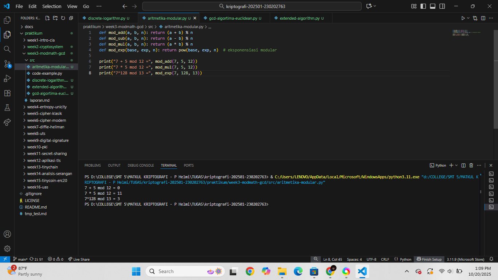
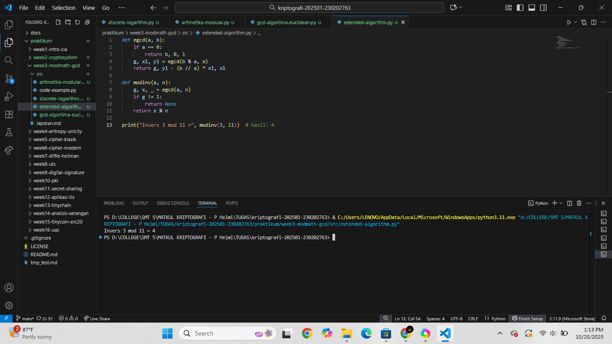
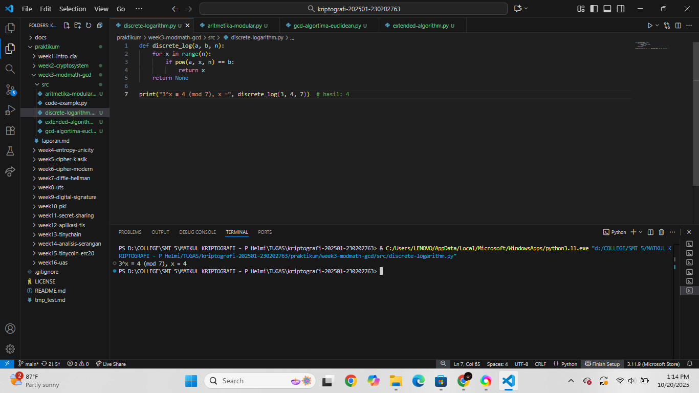

# Laporan Praktikum Kriptografi
Minggu ke-: 3  
Topik: Modular Math (Aritmetika Modular, GCD, Bilangan Prima, Logaritma Diskrit) 
Nama: Laeli Maharani 
NIM: 230202763 
Kelas: 5IKRB 
---

## 1. Tujuan
1. Menyelesaikan operasai aritmetika modular.
2. Menentukan bilangan prima dan menghitung GCD (Greatest Common Divisor).
3. Menerapkan logaritma diskrit sederhana simulasi kriptografi.

---

## 2. Dasar Teori
Aritmetika Modular adalah sistem perhitungan yang menggabungkan operasi pembagian dengan sisa. Konsep ini sering disebut sebagi "perhitungan melingkar", karena setelah mencapai nilai tertentu (modulus), hasil operasi akan kembali ke awal. Dalam kriptografi, aritmetika modular digunakan untuk operasi pada kunci dan pesan yang memilki batas nilai tertentu, seperti pada algoritma RSA atau Diffe-Hellman.

Greatest Common Divisor (GCD) atau faktor persekutuan terbesar adalah bilangan bulat terbesar yang dapat membagi dua bilangan tanpa meninggalkan sisa. Perhitungan GCD sangat penting dalam kriptorafi karena digunakan untuk memastikan dua bilangan bersifar relatif prima, misalnya dalam proses pembentukan kunci pada algoritma RSA. Salah satu metode yang paling efisien untuk menghitung GCD adalah Algoritma Euclidean.

Bilangan prima merupakan bilangan yang hanya memiiki dua faktor, yaitu 1 dan dirinya sendiri. Siat bilangan prima menjadi dasar keamanan banyak sistem kriptografi modern. Misalnya, algoritma RSA bergantung pada kesulitan memfaktorkan hasil perkalian dua bilangan prima besar, yang secara komputasional sangat sulit untuk diblalik.

Logatima Diskrit adalah kebalikan dari operasi perpangkatan dalam aritmerika modular. Masalah logaritma diskrit dikenal sulit diselesaikan, terutama jika modulus yang digunakan sangat besar. Kesulitan ini menjadi dasar keamanan dari beberapa sistem kriptografi seperti Diffe-Helman Key Exchange dan ElGamal.

---

## 3. Alat dan Bahan
- Python 3.x  
- Visual Studio Code / editor lain  
- Git dan akun GitHub  
- Library tambahan (misalnya pycryptodome, jika diperlukan)  )

---

# 4. Langkah Percobaan
1. Membuat file `aritmetika-modular.py` di folder `praktikum/week3-modmath/src/`.
2. Membuat file `gcd-logarithm-euclidean.py` di folder `praktikum/week3-modmath/src/`.
3. Membuat file `extended-algorithm.py` di folder `praktikum/week3-modmath/src/`.
4. Membuat file `discrete-logarithm.py` di folder `praktikum/week3-modmath/src/`.
5. Menyalin kode program dari panduan praktikum.
6. Menjalankan program dengan perintah sesuai nama file.
---

# 5. Source Code
1. Langkah (1) Algoritma Modular
```
def mod_add(a, b, n): return (a + b) % n
def mod_sub(a, b, n): return (a - b) % n
def mod_mul(a, b, n): return (a * b) % n
def mod_exp(base, exp, n): return pow(base, exp, n)  # eksponensiasi modular

print("7 + 5 mod 12 =", mod_add(7, 5, 12))
print("7 * 5 mod 12 =", mod_mul(7, 5, 12))
print("7^128 mod 13 =", mod_exp(7, 128, 13))
```
Hasilnya :
```
7 + 5 mod 12 = 0
7 * 5 mod 12 = 11
7^128 mod 13 = 3
```

2. Langkah (2) GCD dan Algoritma Euclidean
```
def gcd(a, b):
    while b != 0:
        a, b = b, a % b
    return a

print("gcd(54, 24) =", gcd(54, 24))
```
Hasilnya :
```
gcd(54, 24) = 6
```

3. Langkah (3) Extended Euclidean Algorithm
```
def egcd(a, b):
    if a == 0:
        return b, 0, 1
    g, x1, y1 = egcd(b % a, a)
    return g, y1 - (b // a) * x1, x1

def modinv(a, n):
    g, x, _ = egcd(a, n)
    if g != 1:
        return None
    return x % n

print("Invers 3 mod 11 =", modinv(3, 11))  # hasil: 4
```
Hasilnya :
```
Invers 3 mod 11 = 4
```

4. Langkah (4) Logaritma Diskrit (Discrete Log)
```
def discrete_log(a, b, n):
    for x in range(n):
        if pow(a, x, n) == b:
            return x
    return None

print("3^x ≡ 4 (mod 7), x =", discrete_log(3, 4, 7))  # hasil: 4
```
Hasilnya : 
```
3^x ≡ 4 (mod 7), x = 4
```

Source Code Keseluruhan : 
```
def mod_add(a, b, n): return (a + b) % n
def mod_sub(a, b, n): return (a - b) % n
def mod_mul(a, b, n): return (a * b) % n
def mod_exp(base, exp, n): return pow(base, exp, n)  # eksponensiasi modular

print("7 + 5 mod 12 =", mod_add(7, 5, 12))
print("7 * 5 mod 12 =", mod_mul(7, 5, 12))
print("7^128 mod 13 =", mod_exp(7, 128, 13))

def gcd(a, b):
    while b != 0:
        a, b = b, a % b
    return a

print("gcd(54, 24) =", gcd(54, 24))

def egcd(a, b):
    if a == 0:
        return b, 0, 1
    g, x1, y1 = egcd(b % a, a)
    return g, y1 - (b // a) * x1, x1

def modinv(a, n):
    g, x, _ = egcd(a, n)
    if g != 1:
        return None
    return x % n

print("Invers 3 mod 11 =", modinv(3, 11))  # hasil: 4

def discrete_log(a, b, n):
    for x in range(n):
        if pow(a, x, n) == b:
            return x
    return None

print("3^x ≡ 4 (mod 7), x =", discrete_log(3, 4, 7))  # hasil: 4
```
hasilnya :
```
7 + 5 mod 12 = 0
7 * 5 mod 12 = 11
7^128 mod 13 = 3
gcd(54, 24) = 6
Invers 3 mod 11 = 4
3^x ≡ 4 (mod 7), x = 4
```
---

## 6. Hasil dan Pembahasan
(- Lampirkan screenshot hasil eksekusi program (taruh di folder `screenshots/`).  
- Berikan tabel atau ringkasan hasil uji jika diperlukan.  
- Jelaskan apakah hasil sesuai ekspektasi.  
- Bahas error (jika ada) dan solusinya. 

Hasil eksekusi langkah (1) aritmetika modular


Hasil eksekusi langkah (2) GCD dan Algoritma Euclidean


Hasil eksekusi langkah (3) Extended Euclidean Algorithm


Hasil eksekusi langkah (4) Logaritma Diskrit (Discrete Log)


Hasil keseluruhan program :

---

## 7. Jawaban Pertanyaan
1. Peran aritmetika modular dalam kriptografi modern :
   Secara umum, aritmetika modular memungkinkan operasi aritmetika dilakukan dengan batas tertentu (modulus), sehingga hasil perhitungan "berputar kembali" setelah mencapai nilai tertentu. Sifat inilah yang membuat perhitungan menjadi terbatas, efiisien, dan sulit dibalik, yang sangat dibutuhkan dalam sistem enkripsi.
   Dalam kriptografi modern, aritmetika modular digunakan untuk :
   1. Membentuk kunci publik dan prifat , seperti pada algoritma RSA, yang bergantung pada operasi perpangkatan dan invers modulo bilangan hasil dua bilangan prima besar.
   2. Melakukan operasi eksponensial dengan keamanan tinggi, seperti Diffie-Hellman Key Exchange, yang menggunakan perhitungan eksponen dalam module besar untuk menghsilkan kunci rahasia bersama.
   3. Menjamin keamanan algoritma dengan membuat proses dekripsi tanpa kunci menjadi sangat sulit secara komputasional, karena membalik operasi modular ( misalnya menghitung logaritma diskrit) membutuhkan waktu yang sangat lama bahkan untuk komputer modern.

2. Invers modular penting dalam algoritma kunci publik (misalnya RSA)
   Secara sederhana, invers modular adalah bilangan yang jika dikalikan dengan bilangan lain akan menghasikan 1 dalam sistem modulo tertentu. Dalam konteks RSA, invers modular digunakan untuk menemukan pasangan kunci publik dan privat yang saling terkait secara sistematis.
   Pada RSA, proses pembentukan kunci melibatkan langkah-langkah berikut:
   1. Dipilih dua bilangan prima besar p dan q, lalu dihitung n = p x q.
   2. Dihitung nilai fungsi totien ϕ(n)=(p−1)(q−1).
   3. Dipilih bilangan e sebagai kunci publik, dengan syarat gcd(e,ϕ(n))=1.
   4. Kemudian dicari invers modular dari e terhadap ϕ(n), yang disebut d, sehingga berlaku : e×d≡1(modϕ(n))
   Nilai d inilah yang menjadi kunci privat.
Dengan hubungan ini, proses enkripsi dan dekripsi saling membalik secara aman:
C = M^e mod n dan M = C^d mod n
Tanpa nilai d, sangat sulit untuk membalik operasi enkripsi karena mencari invers modular tanpa mengetahui faktor p dan q dari n adalah persoalam sistematis yang sangat sulit. Jadi, invers modular menjamin bahwa hanya pemilik kunci privat yang dapat melakukan dekripsi atau menandatangani pesan, menjadikannya elemen kunci dalam keamanan algoritma RSA.

3. Tantangan utama dalam menyelesaikan logaritma diskrit dalam modulus besar:
Tantangan utamanya terletak pada tingkat kesulitannya yang sangat tinggi secara komputasional. Secara sistematis, masalah logaritma diskrit adalah mencari nilai x yang memenuhi persamaan:
gx≡y(modp)
dengan g, y dan p diketahui.
Artinya, kita ingin menemukan beberapa pangkat x yang membuat g^x menghasilkan y dalam sistem modulo p.
Untuk modulus kecil, nilai x bisa ditemukan dengan mencoba satu per satu (brute force). Namun, jika modulus p berukuran sangat besar (misalnya ratusan atau ribuan bit seperti pada sistem kriptografi modern), pencarian ini menjdi sangat lambat dan praktis tidak mungkin diselesaikan dalam waktu wajar.
Beberapa penyebab utama kesulitannya :
1. Tidak ada algoritma efisien umum yang mempu menyelesaikan logaritma diskrit secara cepat untuk semua jenis modulus besar.
2. Pertumbuhan eksponensial ruang pencarian, setiap bit tambahan pada modulus meningkatkan jumlah kemungkinan nilai x secara drastis.
3. Algoritma terbaik yang ad (Seperti Baby- Step Giant-Step, Pollard's Rho, atau Index Calculus) masih memerlukan waktu yang besar untuk modulus yang digunakan dalam kriptografi (misalnya 2048 bit).

)
---

# 8. Kesimpulan
Melalui praktik menggunakan kode Python tersebut, dapat dipahami bahwa konsep aritmetika modular, GCD, bilangan prima, dan logaritma diskrit merupakan dasar penting dalam kriptografi. Operasi seperti penjumlahan, perkalian, dan perpangkatan modular membantu menjaga nilai tetap dalam batas modulus tertentu, sebagaimana diterapkan pada algoritma kriptografi modern. Perhitungan GCD dan invers modular digunakan untuk menentukan bilangan yang relatif prima dan menemukan kunci dalam sistem seperti RSA. Sementara itu, logaritma diskrit menunjukkan kompleksitas perhitungan yang menjadi dasar keamanan algoritma seperti Diffie-Hellman dan ElGamal. Dengan demikian, konsep-konsep matematis ini membentuk fondasi utama dalam pengamanan data digital.

---

## 9. Daftar Pustaka
(Cantumkan referensi yang digunakan.  
Contoh:  
- Katz, J., & Lindell, Y. *Introduction to Modern Cryptography*.  
- Stallings, W. *Cryptography and Network Security*.  )

---

## 10. Commit Log
(Tuliskan bukti commit Git yang relevan.  
Contoh:
```
commit abc12345
Author: Nama Mahasiswa <email>
Date:   2025-09-20

    week2-cryptosystem: implementasi Caesar Cipher dan laporan )
```
