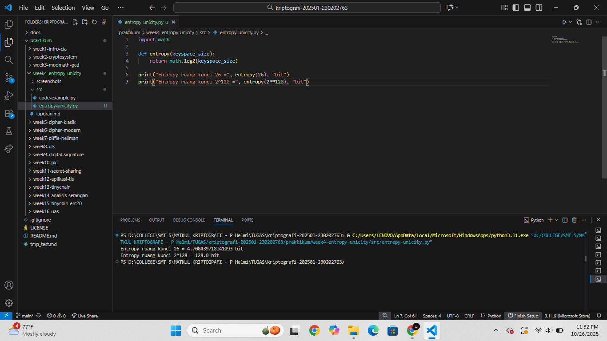
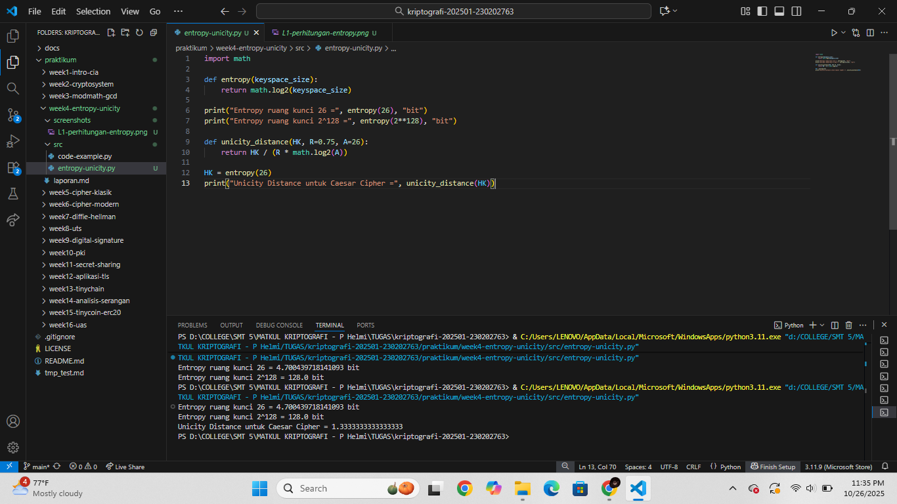
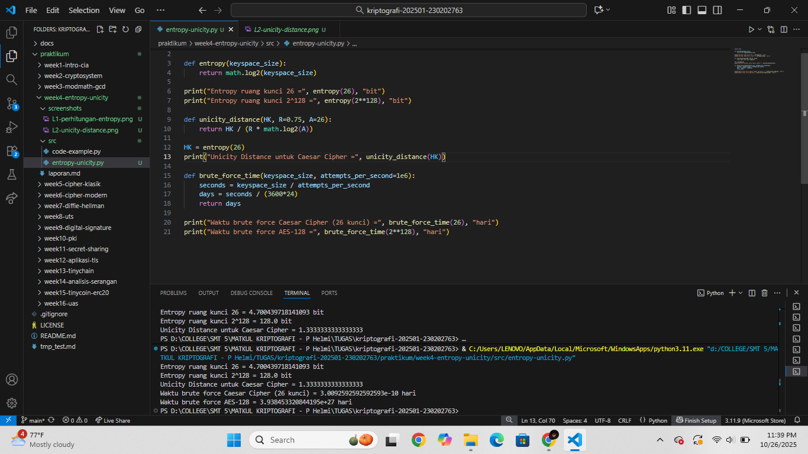

# Laporan Praktikum Kriptografi
Minggu ke-: 4  
Topik: Entropy & Unicity Distance (Evaluasi Kekuatan Kunci dan Brute Force)
Nama: Laeli Maharani
NIM: 230202763
Kelas: 5IKRB
---

## 1. Tujuan
1. Menyelesaikan perhitungan sederhana terkait entropi kunci.  
2. Menggunakan teorema Euler pada contoh perhitungan modular & invers.  
3. Menghitung **unicity distance** untuk ciphertext tertentu.  
4. Menganalisis kekuatan kunci berdasarkan entropi dan unicity distance.  
5. Mengevaluasi potensi serangan brute force pada kriptosistem sederhana.  
---

## 2. Dasar Teori
Dalam kriptografi, entropy menggambarkan tingkat ketidakpastian atau keacakan suatu sistem kunci. Semakin tinggi nilai entropi, semakin sulit bagi pihak yang tidak berwenang untuk menebak kunci secara benar. Entropy biasanya diukur dalam satuan bit, dan menunjukkan berapa banyak kemungkinan kombinasi kunci yang bisa digunakan dalam suatu algoritma. Misalnya, kunci sepanjang 128 bit memiliki 2^128 kemungkinan kombinasi, yang menjadikannya sangat sulit dipecahkan dengan brute force.

Unicity distance adalah ukuran yang menunjukkan jumlah data terenkripsi (ciphertext) minimum yang diperlukan agar serangan kriptanalisis dapat menentukan satu kunci yang benar secara unik. Jika ciphertext yang tersedia lebih kecil dari unicity distance, maka masih terdapat banyak kemungkinan kunci yang dapat menghasilkan pesan yang masuk akal. Dengan kata lain, semakin besar nilai unicity distance, semakin kuat sistem kriptografi terhadap serangan analisis.

Dalam konteks brute force attack, penyerang mencoba semua kemungkinan kunci hingga menemukan yang cocok untuk mendeskripsikan pesan. Kekuatan sistem kriptografi bergantung pada kombinasi tingginya entropy dan besarnya unicity distance, yang membuat pencarian kunci dengan brute force menjadi sangat tidak efisien dan memakan waktu lama. Oleh karena itu, kedua konsep ini penting dalam menilai tingkat keamanan suatu algoritma kriptografi modern.
---

## 3. Alat dan Bahan
(- Python 3.x  
- Visual Studio Code / editor lain  
- Git dan akun GitHub  
- Library tambahan (misalnya pycryptodome, jika diperlukan)  )

---

## 4. Langkah Percobaan

1. Membuat file `entropy-unicity.py` di folder `praktikum/week4-entropy-unicity/src/`.
2. Membuat folder `screenshots` di folder `praktikum/week4-entropy-unicity/src/`.
2. Menyalin kode program dari panduan praktikum.
3. Menjalankan program dengan perintah sesuai nama file.

---

## 5. Source Code
1. Langkah (1) Perhitungan Entropy
```
import math

def entropy(keyspace_size):
    return math.log2(keyspace_size)

print("Entropy ruang kunci 26 =", entropy(26), "bit")
print("Entropy ruang kunci 2^128 =", entropy(2**128), "bit")
```
Hasil :
```
Entropy ruang kunci 26 = 4.700439718141093 bit
Entropy ruang kunci 2^128 = 128.0 bit
```

2. Langkah (2) Menghitung Unicity Distance
```
def unicity_distance(HK, R=0.75, A=26):
    return HK / (R * math.log2(A))

HK = entropy(26)
print("Unicity Distance untuk Caesar Cipher =", unicity_distance(HK))
```
Hasil :
```
Unicity Distance untuk Caesar Cipher = 1.3333333333333333
```

3. Langkah (3) Analsis Brute Force
```
def brute_force_time(keyspace_size, attempts_per_second=1e6):
    seconds = keyspace_size / attempts_per_second
    days = seconds / (3600*24)
    return days

print("Waktu brute force Caesar Cipher (26 kunci) =", brute_force_time(26), "hari")
print("Waktu brute force AES-128 =", brute_force_time(2**128), "hari")
```
Hasil :
```
Waktu brute force Caesar Cipher (26 kunci) = 3.0092592592592593e-10 hari
Waktu brute force AES-128 = 3.938453320844195e+27 hari
```

Source Code keseluruhan :
```
import math

def entropy(keyspace_size):
    return math.log2(keyspace_size)

print("Entropy ruang kunci 26 =", entropy(26), "bit")
print("Entropy ruang kunci 2^128 =", entropy(2**128), "bit")

def unicity_distance(HK, R=0.75, A=26):
    return HK / (R * math.log2(A))

HK = entropy(26)
print("Unicity Distance untuk Caesar Cipher =", unicity_distance(HK))

def brute_force_time(keyspace_size, attempts_per_second=1e6):
    seconds = keyspace_size / attempts_per_second
    days = seconds / (3600*24)
    return days

print("Waktu brute force Caesar Cipher (26 kunci) =", brute_force_time(26), "hari")
print("Waktu brute force AES-128 =", brute_force_time(2**128), "hari")
```
Hasil :
```
Entropy ruang kunci 26 = 4.700439718141093 bit
Entropy ruang kunci 26 = 4.700439718141093 bit
Entropy ruang kunci 2^128 = 128.0 bit
Entropy ruang kunci 2^128 = 128.0 bit
Unicity Distance untuk Caesar Cipher = 1.3333333333333333
Waktu brute force Caesar Cipher (26 kunci) = 3.0092592592592593e-10 hari
Waktu brute force AES-128 = 3.938453320844195e+27 hari
```

---

## 6. Hasil dan Pembahasan
# Hasil eksekusi langkah (1) (perhitungan entropy)

Makna dari Hasil Perhitungan:
Nilai 4,7 bit menunjukkan bahwa sistem dengan 26 kemungkinan kunci memiliki tingkat keacakan rendah, udah ditebak karena jumlah kemungkinan sedikit (mirip seperti memilih satu huruf dari alfabet).
Nilai 128 bit berarti ruang kunci sangat besar (sekitar 3,4 x 10^38 kemungkinan). Ini menunjukkan tingkat keamanan yang tinggi, karena akan sangat sulit bagi serangan brute force untuk mencoba semua kemungkinan kunci.
Semakin besar nilai entropy (dalam bit), semakin tinggi tingkat keacakan dan semakin sulit sistem tersebut dipecakan. Dengan demikian, kunci 128-bit memiliki keamanan jauh lebih kuat dibandingkan ruang kunci kecil seperti 26, karena kemungkinan kombinasi yang harus dicoba penyerang meningkat secara eksponensial.

# Hasil eksekusi langkah (2) Menghitung unicity distance

Keterangan variabel :
HK: entropy kunci (jumlah bit informasi pada ruang kunci).
R: redudansi bahasa, yaitu tingkat keteraturan dalam bahasa alami. Untuk bahasa inggris rata rata sekitar 0,75
A: jumlah alfabet yang digunakan dalam caesar chiper ada 26 huruf).
Nilai 1,33 berarti bahwa dibutuhkan sekitar satu hingga dua huruf ciphertext untuk bisa menebak kunci Caesar Cipher secara pasti.
Dengan kata lain, Caesar Cipher sangat lemah, karena jumlah data yang sangat sedikit saja sudah cukup untuk menentukan kuncinya melalui analisis frekuensi huruf atau brute force.

# Hasil eksekusi langkah (3) Analisis brute force

Makna dari hasil : Caesar Cipher hanya memiliki 26 kemungkinan kunci, sehingga dapat dipecahkan hampir seketika dengan brute force.
AES-128 memilliki 2^128 kemungkinan kunci, yang begitu besar sehingga tidak mungkin dipecahkan secara brute force, bahkan dengan komputer super tercepat sekalipun.
Perhitungan ini menunjukkan bahwa ukuran ruang kunci (keyspace) sangat menentukan kekuatan algoritma kriptografi.
Semakin banyak kemungkinan kunci, semakin besar waktu yang dibutuhkan untuk brute force.
Caesar Cipher sangat lemah karena ruang kuncinya kecil, sedangkan AES-128 sangat aman karena jumlah kombinasi kuncinya sangat besar dan tidak realistis untuk dicoba semua dalam waktu yang masuk akal.
---

## 7. Jawaban Pertanyaan
1: Arti dari nilai entropy dalam konteks kekuatan kunci:
Entropy dalam kriptografi menggambarkan tingkat keacakan atau ketidakpastian suatu kunci. Semakin tinggi nilai entropy (dalam satuan bit), semakin banyak kemungkinan kunci yang dapat digunakan, sehingga semakin sulit bagi penyerang untuk menebak atau mencoba semua kunci secara brute force.
Secara sederhan : 
- Entropy tinggi → ruang kunci besar → banyak kombinasi → sistem lebih aman.
- Entropy rendah → ruang kunci kecil → sedikit kombinasi → mudah ditebak atau dipecahkan.

2: Mengapa unicity distance penting dalam menentukan keamanan suatu cipher
Unicity distance penting karena menunjukkan seberapa banyak ciphertext (pesan terenkripsi) yang dibutuhkan agar penyerang dapat menemukan satu kunci yang benar secara unik melalui analisis kriptografi.
Dengan kata lain, semakin kecil nilai unicity distance, semakin mudah suatu cipher dipecahkan, karena penyerang hanya perlu sedikit ciphertext untuk memastikan kuncinya. Sebaliknya, semakin besar nilai unicity distance, semakin aman cipher tersebut, karena dibutuhkan lebih banyak ciphertext agar analisis kriptografi bisa berhasil menemukan kunci yang tepat.
Unicity distance dipengaruh oleh dua hal utama :
- Entropy kunci (Hₖ): semakin besar ruang kunci → semakin sulit ditebak → unicity distance meningkat.
- Redundansi bahasa (R): semakin tinggi keteraturan bahasa (misalnya dalam teks bahasa alami) → semakin mudah dianalisis → unicity distance menurun.

3. Mengapa brute force masih menjadi ancaman meskipun algoritma sudah kuat?
Brute force masih menjadi ancaman meskipun algoritma kriptografi sudah kuat, karena serangan ini tidak bergantung pada kelemahan logika atau struktur algoritma, melainkan murni mencoba semua kemungkinan kunci hingga menemukan yang benar. Artinya, bahkan algoritma terenkripsi paling aman sekalipun seperti AES bisa saja dipecahkan — hanya saja membutuhkan waktu yang sangat lama jika kuncinya cukup panjang.

Ancaman ini tetap relevan karena kemajuan teknologi komputasi terus meningkat. Superkomputer, komputasi paralel, hingga perkembangan komputasi kuantum berpotensi mempercepat proses brute force secara drastis. Selain itu, jika pengguna menggunakan kunci yang lemah, terlalu pendek, atau mudah ditebak, maka waktu brute force menjadi jauh lebih singkat.

Oleh karena itu, meskipun algoritma kriptografi modern aman secara teoritis, keamanan praktisnya tetap tergantung pada kekuatan kunci. Penggunaan kunci yang panjang, acak, dan kompleks sangat penting untuk mencegah brute force menjadi ancaman nyata.
---

## 8. Kesimpulan
Entropy dan Unicity Distance merupakan konsep penting dalam menilai kekuatan kunci kriptografi. Entropy menunjukkan tingkat keacakan kunci — semakin tinggi nilainya, semakin sulit kunci ditebak. Sementara Unicity Distance menunjukkan jumlah ciphertext yang dibutuhkan untuk menemukan satu kunci yang benar — semakin besar nilainya, semakin aman cipher tersebut. Melalui evaluasi ini dapat dipahami bahwa kekuatan sistem kriptografi tidak hanya bergantung pada algoritmanya, tetapi juga pada panjang, keacakan, dan jumlah kemungkinan kunci yang digunakan agar tahan terhadap serangan brute force.
---

## 9. Daftar Pustaka
(Cantumkan referensi yang digunakan.  
Contoh:  
- Katz, J., & Lindell, Y. *Introduction to Modern Cryptography*.  
- Stallings, W. *Cryptography and Network Security*.  )

---

## 10. Commit Log
```
commit week4-entropy-unicity
Author: Laeli Maharani <laelimaharani09@gmail.com>
Date:   2025-07-10

    week4-entropy-unicity: (Evaluasi Kekuatan Kunci dan Brute Force dan laporan).
```
