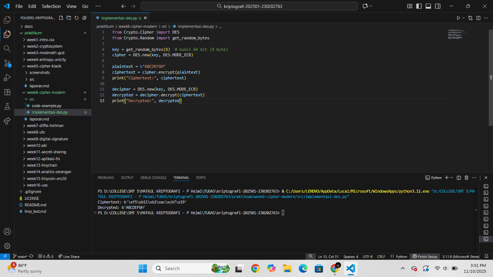
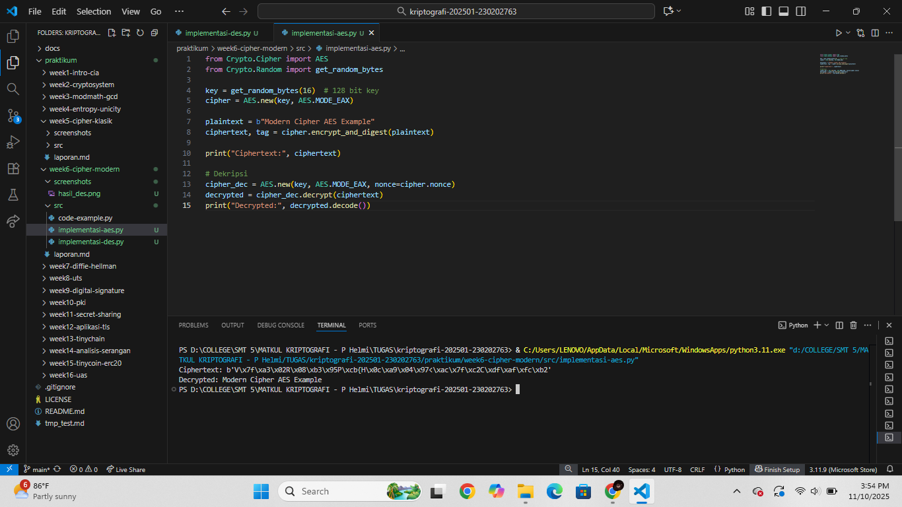
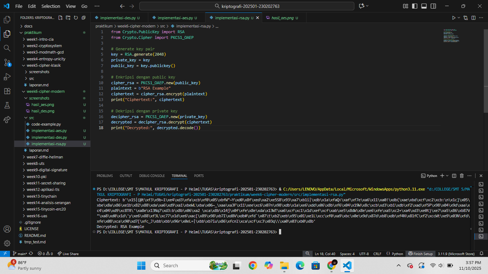

# Laporan Praktikum Kriptografi
Minggu ke-: 6  
Topik: Cipher Modern (DES, AES, RSA)  
Nama: Laeli Maharani  
NIM: 230202763  
Kelas: 5IKRB  

---

## 1. Tujuan
1. Mengimplementasikan algoritma DES untuk blok data sederhana.
2. Menerapkan algoritma AES dengan panjang kunci 128 bit.
3. Menjelaskan proses pembangkitan kunci publik dan privat pada algoritma RSA.

---

## 2. Dasar Teori
Cipher modern merupakan bentuk kriptografi yang digunakan pada era komputer untuk melindungi data digital. Berbeda dengan cipher klasik seperti Caesar attau Vigenere, cipher modern berkerja menggunakan algoritma matematika kompleks dan kunci enkripsi panjang yang sulit dipecahkan dengan analisis manual. Cipher modern terbagi menjadi dua jenis utama, yaitu kriptografi simetris (satu kunci untuk enkripsi dan dekripsi) dan kriptografi asimetris (menggunakan pasangan kunci publik dan privat).

DES (Data Enkcryption Standard) adalah algoritma kriptografi simetris yang dikembangkan pada tahun 1970-an. DES menggunakan kunci 56-bit dan bekerja dengan membagi data menjadi blok 64-bit, lalu menerapkan proses substitusi dan transposisi sebanyak 16 kali putaran. Walaupun pernah menjadi standar internasional, DES kini dianggap kurang aman karena panjang kuncinya terlalu pendek untuk menghadapi serangan brute force modern.

AES (Advanced Encryption Standard) merupakan penerus DES yang lebih aman dan efisien. AES menggunaakn kunci 128, 192, atau 256-bit, serta bekerja dalam blok 128-bit. Algoritma ini menggunakan operasi substitusi, pergeseran baris, pencampuran kolom, dan penambahan kunci dalam bebrapa putaran tergantung panjang kuncinya. AES kini menjadi standar enkripsi global dan digunakan secara luas dalam keamanan jaringan, file, serta komunikasi digital.

RSA (Rivest-Shamir_Adleman) adalah algoritma kriptografi asimetris yang menggunakan dua kunci berbeda: kunci publik untuk enkripsi dan kunci privat untuk dekripsi. RSA didasarkan pada konsep faktorisasi bilangan prima besar, yang membuatnya sangat sulit dipecahkan tanpa mengetahui kunci privat. RSA banyak digunakan untuk keamananinternet, seperti tanda tangan digital, enkripsi email, dan protokol SSL/TLS.

---

## 3. Alat dan Bahan
(- Python 3.x  
- Visual Studio Code / editor lain  
- Git dan akun GitHub  
- Library tambahan (misalnya pycryptodome, jika diperlukan)  )

---

## 4. Langkah Percobaan
(Tuliskan langkah yang dilakukan sesuai instruksi.  
Contoh format:
1. Membuat file `caesar_cipher.py` di folder `praktikum/week2-cryptosystem/src/`.
2. Menyalin kode program dari panduan praktikum.
3. Menjalankan program dengan perintah `python caesar_cipher.py`.)

---

## 5. Source Code
Langkah 1 -- Implementasi DES (Opsional, simulasi)
```python
from Crypto.Cipher import DES
from Crypto.Random import get_random_bytes

key = get_random_bytes(8)  # kunci 64 bit (8 byte)
cipher = DES.new(key, DES.MODE_ECB)

plaintext = b"ABCDEFGH"
ciphertext = cipher.encrypt(plaintext)
print("Ciphertext:", ciphertext)

decipher = DES.new(key, DES.MODE_ECB)
decrypted = decipher.decrypt(ciphertext)
print("Decrypted:", decrypted)
```
Langkah 2 -- Implemetasi AES-128
```python
from Crypto.Cipher import AES
from Crypto.Random import get_random_bytes

key = get_random_bytes(16)  # 128 bit key
cipher = AES.new(key, AES.MODE_EAX)

plaintext = b"Modern Cipher AES Example"
ciphertext, tag = cipher.encrypt_and_digest(plaintext)

print("Ciphertext:", ciphertext)

# Dekripsi
cipher_dec = AES.new(key, AES.MODE_EAX, nonce=cipher.nonce)
decrypted = cipher_dec.decrypt(ciphertext)
print("Decrypted:", decrypted.decode())
```
Langkah 3 -- Implementasi RSA
```python
from Crypto.PublicKey import RSA
from Crypto.Cipher import PKCS1_OAEP

# Generate key pair
key = RSA.generate(2048)
private_key = key
public_key = key.publickey()

# Enkripsi dengan public key
cipher_rsa = PKCS1_OAEP.new(public_key)
plaintext = b"RSA Example"
ciphertext = cipher_rsa.encrypt(plaintext)
print("Ciphertext:", ciphertext)

# Dekripsi dengan private key
decipher_rsa = PKCS1_OAEP.new(private_key)
decrypted = decipher_rsa.decrypt(ciphertext)
print("Decrypted:", decrypted.decode())
```


---

## 6. Hasil dan Pembahasan
Hasil eksekusi langkah 1 -- Implementasi DES (opsional)

DES (Data Encrypription Standard) adalah algoritma simetris yang bekerja pada blok data 64-bit (8 byte) menggunakan kunci sepanjang 56-bit. Artinya kunci yang sama digunakanuntuk proses enkripsi dan dekripsi.
Pada kode di atas, digunakan pustaka `Crypto.Chiper.DES` dengan mode ECB (Electronic Codebook), yang mengenkripsi setiap blok secara terpisah.

Penjelasan enkripsi:
Fungsi `cipher.encrypt(plaintext)` melakukan langkah berikut:
- Kunci dihasilkan secara acak dengan `get_random_bytes(8)` yang menghasilkan 64-bit.
- Plaintect berisi `b"ABCDEFGH"` yang panjangnya tepat 8 byte, sehingga tidak perlu padding.
- DES mempreoses plaintext melalui 16 putaran transformasi (substitusi dan permutasi) menggunakan subkunci yang berbeda di setiap putaran.
- Hasil akhirnya adalah ciphertext biner acak yang tidak bisa dibaca manusia, misalnya:
```
Ciphertext: b'\xec7\xe5\t\xbe\xe5\x86\xb8'

```
Penjelasan dekripsi:
Fungsi `decipher.decrypt(ciphertext)` melakukan proses kebalikan dari enkripsi:
- Menggunakan kunci yang sama seperti saat enkripsi.
- DES menjalankan kembali 16 putaran transformasi secara terbalik.
- Menghasilkan kembali teks asli `Decrypted: b'ABCDEFGH'`

Hasil eksekusi langkah 2 -- Implementasi AES-128

AES adalah algoritma kriptografi simetris modern yang bekerja dengan blok 128 bit dan mendukung panjang kunci 128, 192, atau 256 bit. Pada kode ini dugunakan kunci 128-bit dengan mode EAX, yaitu mode yang menyediakan enkripsi sekaligus verifikasi keaslian data.

Proses enkripsi :
- `get_random_bytes(16)` membuat kunci acak sepanjang 16 byte.
- `AES.new(key, AES.MODE_EAX)` membuat objek cipher dengan nonce (angka acak unik).
- `encrypt_and_digesti(plaintext)` menenkripsi data dan menghasilkan ciphertext serta tag autentikasi.
  Hasil ciphertext berupa data biner acak seperti :
  ```python
  Ciphertext: b'/\xd9\x839\xe0\xdfm.q\x858\xc5\xb2\x7f\xbc\xeb\xbeV(e\x86\x99\xf9\xd0\x0e'
  ```
  Bentuknya acak karena merupakan hasil proses matematis kompleks pada level bit.

Proses dekripsi:
- Cipher diinisialisasi ulang dengan kunci dan `nonce` yang sama.
- `decrypt(ciphertext)` mengembalikan teks asli:
  ```
  Decrypted: Modern Cipher AES Example

  ```

Hasiil eksekusi langkah 3 -- Implementasi RSA

RSA adalah algoritma kriptografi asimetris, artinya menggunaakn dua kunci berbeda:
- Public key untuk enkripsi
- Private key untuk dekripsi
Pada kode ini digunakan panjang kunci 2048 bit, yang cukup kuat untuk keamanan modern.

Proses Enkripsi:
- `RSA.generate(2048)` membuat sepasang kunci (public dan private) secara acak.
- `PKCS1_OAEP.new(public_key)` membuat objek cipher menggunakan public key dan skema padding OAEP agar hasil lebih aman.
- `encrypt(plaintext)` mengenkripsi teks `"RSA Example"` menjadi ciphertext berupa deretan byte acak, contohnya :
```python
Ciphertext: b'\x17T@\xe2\x1be@\x9d\x91F\xa2s...'
```
Bentuk ciphertext ini tampak acak karena pesan telah diubah menjadi bilangan besar dan diproses dengan operasi matematika eksponensial pada kunci publik.

Proses dekripsi:
- `PKCS1_OAEP.new(private_key)` membuat objek dekripsi dengan private key.
- `decrypt(ciphertext)` membalik proses enkripsi dan menghasilkan teks asli kemnbali:
```
Decrypted: RSA Example
```
RSA mengenkripsi data dengan dua kunci berbeda sehingga lebih aman untuk komunikasi publik. Hanya private key yang bisa membuka hasil enkripsi dari public key. Karena itu, RSA banyak digunakan dalams sistem keamanan digital seperti SSL/TLS, tanda tangan digital, dan pengiriman kunci rahasia.

---

## 7. Jawaban Pertanyaan
1. Apa perbedaan mendasar antara DES, AES< dan RSA dalam hal kunci dan keamanan?

| Algoritma                              | Jenis Kriptografi | Panjang Kunci          | Keamanan                           | Keterangan                                                                                                            |
| -------------------------------------- | ----------------- | ---------------------- | ---------------------------------- | --------------------------------------------------------------------------------------------------------------------- |
| **DES (Data Encryption Standard)**     | Simetris          | 56-bit                 | Lemah (mudah diserang brute force) | Menggunakan satu kunci untuk enkripsi dan dekripsi. Kini sudah jarang digunakan karena kuncinya terlalu pendek.       |
| **AES (Advanced Encryption Standard)** | Simetris          | 128, 192, atau 256-bit | Sangat kuat                        | Juga menggunakan satu kunci, namun lebih aman karena kunci lebih panjang dan proses enkripsi lebih kompleks.          |
| **RSA (Rivest–Shamir–Adleman)**        | Asimetris         | 1024–4096 bit          | Sangat kuat                        | Menggunakan pasangan kunci publik dan privat. Aman karena didasarkan pada kesulitan faktorisasi bilangan prima besar. |


2. Mengapa AES lebih banyak digunakan dibanding DES di era modern?
AES lebih banyak digunakan dibanding DES di era modern karena AES memiliki tingkat keamanan yang jauh lebih tinggi dan efisien yang lebih baik.
Berikut penjelasannya:
- Panjang kunci lebih besar - DES hanya menggunakan algoritma kunci 56-bit yang mudah diserang dengan brute force, sedangkan AES mendukung 128, 192, dan 256-bit, membuatnya hampir mustahil ditembus dengan serangan brute force modern.
- Struktur algoritma lebih kuat - AES menggunakan operasi substitusi, permutasi, dan transformasi matriks yang kompleks, sehingga lebih tahan terhadap analisis kriptografi.
- Performa tinggi - AES dioptimalkan untuk pereangkat keras maupun perangkat lunak, sehingga cepat digunakan di berbagai sistem modern.
- Standar keamanan internasional - AES ditetapkan oleh NISt sebagai standar enkripsi resmi menggantikan DES, dan digunakn secara luas di pemerintahan, industri, serta komunikasi digital.

3. Mengapa RSA diketegorikan sebagai algoritma asimetris, dan bagaimana proses pembangkitan kuncinya?
RSA dikategorikan sebagai algoritam asimetris karena menggunakan dua kunci yang berbeda, yaitu:
- Kunci publik untuk enkripsi (dapat dibagikan ke siapa saja).
- Kunci privat untuk dekripsi (hanya diketahui oleh pemiliknya).
Berbeda dengan algoritma simeetris (seperti AES dan DES) yang hanya memakai satu kunci yang sama untuk enkripsi dan dekripsi, RSA memisahkan kedua fungsi tersebut agar lebih aman dalam komunikasi publik.

Proses pembangkitan kunci RSA secara sederhana:
1. Pilih dua bilangan prima besar, misalnya p dan q.
2. Hitung n = p x q, yang akan menjadi bagian dari kunci publik dan privat.
3. Hitung φ(n) = (p - 1)(q - 1).
4. Pilih bilangan e yang relatif prima terhadap φ(n) (biasanya nilai kecil seperti 65537)
5. Hitung d, yaitu invers modular dari e terhadap φ(n):
   d x e = 1(modφ(n)).
6. Hasilnya :
   - Kunci publik = (e, n)
   - Kunci privat = (d, n).


   
)
---

## 8. Kesimpulan
(Tuliskan kesimpulan singkat (2–3 kalimat) berdasarkan percobaan.  )

---

## 9. Daftar Pustaka
(Cantumkan referensi yang digunakan.  
Contoh:  
- Katz, J., & Lindell, Y. *Introduction to Modern Cryptography*.  
- Stallings, W. *Cryptography and Network Security*.  )

---

## 10. Commit Log
(Tuliskan bukti commit Git yang relevan.  
Contoh:
```
commit week6-cipher-modern
Author: Laeli Maharani <laelimaharani09@gmail.com>
Date:   2025-10-11

    week6-cipher-modern: implementasi cipher modern (DES, AES, RSA) dan laporan)
```
