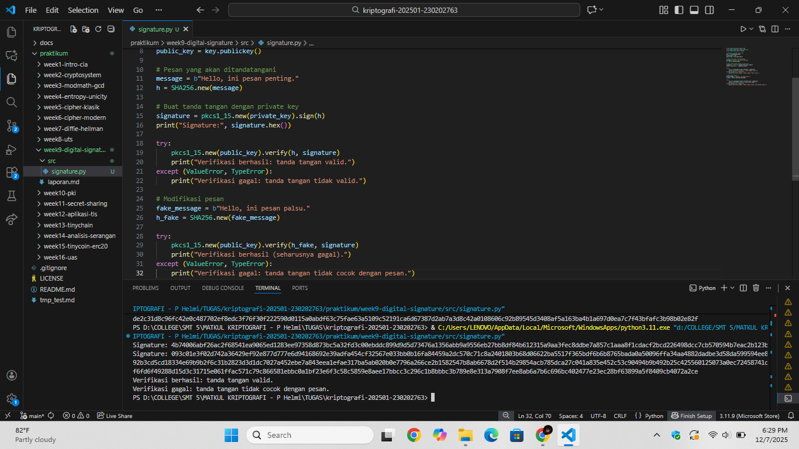

# Laporan Praktikum Kriptografi
Minggu ke-: 9 
Topik: Digital Signature (RSA/DSA)  
Nama: Laeli Maharani  
NIM: 230202763  
Kelas: 5IKRB  

---

## 1. Tujuan
1. Mengimplemntasikan tanda tangan digital menggunakan algoritma RSA/DSA.
2. Memverifikasi keaslian tanda tangan digital.
3. Menjelsakan manfaat tanda tangan digital dalam otentikasi pesan dan itegritas data.

---

## 2. Dasar Teori
Digital SIgnature atau tanda tangan digital adalah mekanisme kriptografi yang digunakan untuk memastikan keaslian, integritas dan non-repudiation dari sebuah pesan atau dokumen elektronik. Berbeda dari enkripsi yang bertujuan merahasiakan data, tanda tangan digital fokus pada pembuktian bahwa suatu pesan benar-benar dikirim oleh pihak yang saha dan tidak mengalami perubahan selama proses transmisi. Mekanisme ini selalu menggunakan fungsi hash untuk menghasilkan representasi unik dari pesan sebelum ditandatangani.

Pada RSA Digital SIgnature, prosesnya dilakukan dengan "membalik" mekanisme enkripsi RSA. Pengirim membuat signature dengan cara mengenkripsi hash pesan menggunakan privarte key, lalu penerima memverifikasinya menggunakan private key, lalu penerima memverifikasinya menggunakan public key. Jika hasil verifikasi sesuai dengan hash pesan, maka penerima dapat memastikan bahwa pesan tersebut asli dan tidak dimodifikasi. Keamanan RSA Signature terletak pada kesulitan memfaktorkan bilangan besar, sehingga dapat sangat sulit dipalsukan tanpa private key.

Sedangkan DSA (Digital Signature Algorithm) bekerja berdasarkan Discrete Logarithm Problem dan menghasilkan tanda tangan berupa pasangan nilai (r,s) yang dihitung menggunakan private key dan nilai acak k. Penerima kemudian memverifikasi signature menggunakan public key dan formula DSA. Baik RSA maupun DSA memberikan jaminan kuat terhadap integritas dan autentikasi pesan, menjadikan digital signature sebagai fondasi penting dalam keamanan modern, seperti pada SSL/TLS, e-commerce, dan distribusi perangkat lunak.

---

## 3. Alat dan Bahan
- Python 3.x  
- Visual Studio Code / editor lain  
- Git dan akun GitHub  
- Library tambahan (misalnya pycryptodome, jika diperlukan)  )

---

## 4. Langkah Percobaan
1. Membuat file `signature.py` di folder `praktikum/week9-digital-signature/src/`.
2. Menyalin kode program dari panduan praktikum.
3. Menjalankan program dengan perintah sesuai nama file.
4. Membuat folder `screenshots` di folder `praktikum/week9-digital-signature/`.
5. Menempelkan hasil eksekusi program ke folder `screenshots`.

---

## 5. Source Code
Langkah 1 -- Gerakan Key dan Buat Tanda Tangan
```python
from Crypto.PublicKey import RSA
from Crypto.Signature import pkcs1_15
from Crypto.Hash import SHA256

# Generate pasangan kunci RSA
key = RSA.generate(2048)
private_key = key
public_key = key.publickey()

# Pesan yang akan ditandatangani
message = b"Hello, ini pesan penting."
h = SHA256.new(message)

# Buat tanda tangan dengan private key
signature = pkcs1_15.new(private_key).sign(h)
print("Signature:", signature.hex())
```
Lamgkah 2 -- Verifikasi Tanda Tangan
```python
try:
    pkcs1_15.new(public_key).verify(h, signature)
    print("Verifikasi berhasil: tanda tangan valid.")
except (ValueError, TypeError):
    print("Verifikasi gagal: tanda tangan tidak valid.")
```
Langkah 3 -- Uji Modifikasi Pesan
```python
# Modifikasi pesan
fake_message = b"Hello, ini pesan palsu."
h_fake = SHA256.new(fake_message)

try:
    pkcs1_15.new(public_key).verify(h_fake, signature)
    print("Verifikasi berhasil (seharusnya gagal).")
except (ValueError, TypeError):
    print("Verifikasi gagal: tanda tangan tidak cocok dengan pesan.")
```

---

## 6. Hasil dan Pembahasan
Hasil eksekusi program digital signature:


Tanda tangan digital signature digunakan untuk membuktikan keaslian dan integirtas pesan. Prosesnya melibatkan dua operasi utama yaitu:
- Signing (menandatangani pesan) dengan private key.
- Verifikasi dengan public key.
Pada praktikum ini, kode dibagi menjadi 3 langkah yaitu : membuat tanda tangan, memverifikasi, dan menguji perubahan pesan.

Langkah 1 -- Generate Key & Buat Tanda Tangan
Pada bagian ini :
- Program menghasilkan pasangan kunci RSA: private key dan public key.
- Pesan asli `(Hello, ini pesan penting)` dihitung hash-nya menggunakan SHA-256.
- Hash tersebut ditandatangani menggunakan private key dengan algoritma PKCS#1 vl.5.
- Hasilnya adalah signature berupa deretan angka heksadesimal acak seperti :
```
Signature: c62bef54d53958dfda079f34...
```
Tanda tangan ini adalah hasil operasi matematika RSA, pada hash, sehingga bentuknya tampah acak.

Langkah 2 -- Verifikasi Tanda Tangan
Pada tahap ini:
- Program menggunakan public key untuk memverifikasi apakah signature cocok dengan hash pesan asli.
- Jika signature valid, program menampilkan:
```python
Verifikasi berhasil: tanda tangan valid.
```
Karena signature dibuat dari pesan yang sama dan kunci pasangannya benar, verifikasi berjalan sukses.

Langkah 3 - Uji Modifikasi Pesan
Pada tahap ini diuji apakah tanda tangan tetap valid jika pesannya diubah. 
- Pesan dibuah menjadi : `"Hello, ini pesan palsu"`
- Hash baru dibuat (`h_fake`).
- Program mencoba memverifikasi signature lama terhadap hash pesan palsu.
Karena isi pesan berubah, hash juga beruabh, sehingga tanda tangan tidak cocok dan output menjadi :
```python
Verifikasi gagal: tanda tangan tidak cocok dengan pesan.
```
Ini menunjukkan bahwa tanda tangan digital menjamin integritas meskipun hanya satu karakter berubah, verifikasi langsung gagal.

Melalui praktikum ini, saya memahami bahwa tanda tangan digital RSA valid untuk pesan yang benar-benar sama dengan yang ditandatangani. Perubahan kecil pada pesan menyebabkan verifikasi gagal, sehingga integritas dan keaslian pesan dapat dipastikan sepenuhnya.

---

## 7. Jawaban Pertanyaan
Pertanyaan 1: Perbedaan utama antara enkripsi RSA dan tanda tangan digital RSA

Perbedaan utamanya terletak pada arah penggunaan kunci.
- Enkripsi RSA: Menggunakan public key untuk mengenkripsi dan private key untuk mendekripsi, tujuannya menjaga kerahasiaan pesan.
- Tanda tangan digital RSA: Menggunakan private key untuk menandatangani dan public key untuk memverifikasi tanda tangan, tujuannya memastikan keaslian (authenticity) dan integritas pesan, bukan kerahasiaan.

Pertanyaan 2: Mengapa tanda tangan digital menjamin integritas dan otentikasi pesan?

Tanda tangan digital menggunakan hash dari pesan yang ditandatangani dengan private key. Jika pesan diubah sedikit saja, hash tidak akan cocok lagi sehingga integritas terjamin. Karena hanya pemilik asli yang memiliki private key, maka siapa pun yang berhasil memverifikasi tanda tangan menggunakan public key akan yakin bahwa pesan tersebut benar berasal dari pengirim yang sah, sehingga memberikan otentikasi.

Pertanyaan 3: Peran Certificate Authority (CA) dalam sistem tanda tangan digital modern

Certificate Authority (CA) berperan sebagai pihakketika terpercaya yagn memvrerifikasi identitas pemilik public key dan menerbitkan sertifikat digital. Dengan adanya CA, public key dapat dipercaya karena sudah divalidasi secara resmi, sehingga mencegah pemalsuan identitas dan serangan man-in-the-middle.

---

## 8. Kesimpulan
Berdasarkan praktikum digital signature RSA, saya menyimpulkan bahwa tanda tangan digital hanya akan valid jika pesan yang diverifikasi identik dengan pesan asli yang ditandatangani. Perubahan sekecil apapun pada isi pesan langsung membuat verifikasi gagal, sehingga integritas dan keaslian data benar-benar terjamin. Selain itu, penggunaan pasangan private key-public key memastikan bahwa hanya pengirim sah yang bisa membuat tanda tangan, sementara siapa pun dapat memverifikasinya.

---

## 9. Daftar Pustaka
(Cantumkan referensi yang digunakan.  
Contoh:  
- Katz, J., & Lindell, Y. *Introduction to Modern Cryptography*.  
- Stallings, W. *Cryptography and Network Security*.  )

---

## 10. Commit Log
(Tuliskan bukti commit Git yang relevan.  
Contoh:
```
commit week9-digital-signature
Author: Laeli Maharani <laelimaharani09@gmail.com>
Date:   2025-12-07

    week9-digital-signature: implementasi digital signature (RSA/DSA) dan laporan
```
